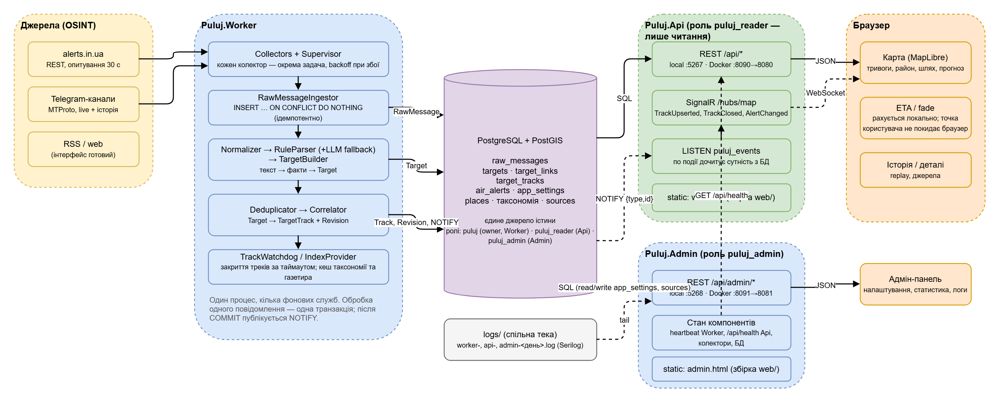

# Puluj-G

Цивільне ситуаційне оповіщення про повітряні загрози з відкритих джерел: збір повідомлень (alerts.in.ua, Telegram),
нормалізація → `Target` → `TargetTrack`, карта з напрямком руху, ETA до вашої точки та повним ланцюжком джерел.
Специфікація — [`Puluj.md`](Puluj.md). Головний принцип: *«Що саме ми показуємо, звідки це взялося і наскільки ми в цьому впевнені?»*

## Документація

Єдиний план розвитку черги, воркерів, інших подій, карт та аналітики, з задачами й інструкціями для агентів:
[`docs/plan-message-platform.md`](docs/plan-message-platform.md). Це цільова програма; статус реалізації ведеться всередині.

Базовий устрій описано в [`docs/README.md`](docs/README.md). Редаговані діаграми алгоритмів, БД, коду, live-взаємодій і Docker deploy — у [`docs/diagrams/`](docs/diagrams/README.md). Правила кореляції, її конфігурація та безпечне впровадження змін — у [`docs/correlation.md`](docs/correlation.md). Правила ізоляції цього форку, імена контейнерів та порти — у [`docs/fork-deployment.md`](docs/fork-deployment.md).

## Архітектура




| Проєкт | Призначення |
|---|---|
| `src/Puluj.Domain` | сутності та enum-и (§5–§11 spec) |
| `src/Puluj.Infrastructure` | EF Core + PostGIS, міграції, seed (таксономія, джерела, газетир), ingestion, NOTIFY |
| `src/Puluj.Collectors` | `AlertsInUaCollector`, `TelegramCollector` (WTelegramClient), supervisor з backoff |
| `src/Puluj.Processing` | Normalizer, RuleParser, LlmParser, TargetBuilder, Correlator, TrackWatchdog |
| `src/Puluj.Worker` | хост збору та обробки; `Worker:Roles` (`migrate`, `telegram`, `alerts`, `processing`) вибирає, що саме запускає процес — у Docker кожна роль у своєму контейнері, без ролей усе разом |
| `src/Puluj.Api` | публічна частина (:5267): REST (`/api/*`), SignalR (`/hubs/map`), роздача карти; БД лише на читання (роль `puluj_reader`) |
| `src/Puluj.Admin` | адмін-панель (:5268): налаштування, рейтинг джерел, стан/статистика кожного компонента, логи; роль `puluj_admin` |
| `src/Puluj.Analytics`, `Puluj.Analytics.Worker` | аналітика джерел окремим сервісом (:5269, контейнер `analytics`): порівнює тексти повідомлень — хто кого копіює, затримки, пересилання, активність, хто перший відкриває треки; власна схема `analytics`, сторінка «Аналітика» в панелі |
| `web/` | React + Vite + MapLibre; дві точки входу (`index.html` карта, `admin.html` панель); ETA рахується в браузері |
| `data/` | seed: `taxonomy/*.json`, `sources.json`, `gazetteer/regions.json`, `corpus/cases.json` (golden-тести парсера) |

## Швидкий старт (Docker)

```bash
cp .env.example deploy/.env            # ADMIN_TOKEN обов’язковий (панель у Docker не бачить localhost); токени джерел можна ввести в панелі (⚙) — вони зберігаються в БД
pwsh scripts/gazetteer/download.ps1   # або scripts/gazetteer/download.sh — геодані (~80 MB, не в git)
pwsh scripts/deploy.ps1 -InitializeDatabase  # лише для першої, порожньої інсталяції
# Надалі: pwsh scripts/deploy.ps1 — міграції оновлять наявну БД, а налаштування в ній залишаться
# карта http://localhost:8090, адмін-панель http://localhost:8091  (health: /api/health на обох)
```

Контейнери: `postgis`, `migrate` (one-shot: міграції + seed, решта чекає його завершення), `collector-telegram`, `collector-alerts`,
`processor` (парсинг, кореляція, watchdog — 2 репліки, масштабується), `api`, `admin`. Усі — з одного образу Worker-а з різним `Worker__Roles`;
між собою спілкуються лише через PostgreSQL (`raw_messages` + NOTIFY), тож будь-який можна перезапустити окремо:
`docker compose -p puluj-g -f deploy/docker-compose.yml restart collector-telegram`.

## Локальна розробка (без Docker)

Потрібні: .NET 10 SDK, Node 24, PostgreSQL 17 + PostGIS (БД `puluj`, користувач/пароль `puluj`).

```powershell
pwsh scripts/gazetteer/download.ps1        # один раз
pwsh scripts/dev-run.ps1 -ResetDb          # build + міграції/seed + запуск Worker, Api (5267) і Admin (5268) у фоні
cd web && npm install && npm run dev       # карта http://localhost:5183 (проксі на Api); npm run dev:admin — панель http://localhost:5184
python scripts/dev-scenario.py             # демо-ситуація через POST /api/admin/dev/ingest
```

`npm run build` збирає обидва SPA у `src/Puluj.Api/wwwroot` і `src/Puluj.Admin/wwwroot`, після чого `http://localhost:5267/` віддає карту, а `http://localhost:5268/` — панель.
`pwsh scripts/dev-run.ps1 -Public` робить це автоматично і відкриває обидва сервіси на всіх інтерфейсах (`http://<LAN-IP>:5267`, `:5268`) — доступ з інших пристроїв у мережі без Vite; правила firewall для 5267/5268 додаються один раз (потрібен запуск від адміністратора).

Ролі БД: Worker — owner `puluj` (мігрує), Api — `puluj_reader` (лише читання), Admin — `puluj_admin`; обидві службові ролі створює міграція з паролем = ім'я ролі, змінити: `ALTER ROLE puluj_reader PASSWORD '…'` + connection string сервісу.

## Конфігурація (env / appsettings)

| Ключ | Опис |
|---|---|
| `ConnectionStrings__Puluj` | PostgreSQL |
| `Collectors__AlertsInUa__Enabled`, `…__Token` | alerts.in.ua API (polling 30 с) |
| `Collectors__Telegram__Enabled`, `…__ApiId`, `…__ApiHash`, `…__Phone`, `…__SessionPath` | MTProto-сесія; код входу — `…__VerificationCode` або файл `<SessionPath>.code` |
| `Llm__Enabled`, `Llm__Model`, `ANTHROPIC_API_KEY` | LLM fallback парсера (вмикається лише коли правила нічого не знайшли) |
| `Correlation__CandidateWindowMinutes` (120), `Correlation__AttachThreshold` (0.6), `Correlation__AmbiguityMargin` (0.05), `Correlation__DuplicateWindow` (3 хв) | вікно пошуку кандидатів, мінімальний бал, мінімальна перевага над другим кандидатом, дедуплікація |
| `Seed__DataDirectory` | шлях до `data/` (за замовчуванням шукається вгору від content root) |

Канали Telegram та довіра до джерел задаються у `data/sources.json`; таксономія цілей і aliases — у `data/taxonomy/`
(upsert при кожному старті Worker, без змін коду).

## Тести

```powershell
dotnet test tests/Puluj.Processing.Tests          # парсер (golden corpus), корелятор, LLM-мапінг
$env:PULUJ_TEST_CONNECTION="Host=localhost;Port=5442;Database=puluj_test;Username=puluj;Password=puluj"
$env:PULUJ_TEST_ALLOW_RESET="1"                    # лише для одноразової _test БД: fixture очищує дані
dotnet test tests/Puluj.Integration.Tests         # end-to-end на реальній PostGIS (або Testcontainers, якщо є Docker)
cd web && npm test                                # ETA / fade
```

Додати новий випадок парсингу = додати запис у `data/corpus/cases.json`.

Перевірка P00 на автоматичній одноразовій PostGIS: `pwsh scripts/test-p00.ps1 -Baseline`.
Команда виконує race-тести, SQL inventory та baseline 1/2/4 workers; результати — у
[`docs/evidence/message-platform/`](docs/evidence/message-platform/P00-handoff.md).

P16 release gate: `pwsh scripts/test-p16.ps1`. Він запускає на disposable Testcontainers PostGIS/RabbitMQ canary
ownership, crash/replay/lifecycle regression і матрицю committed-outcome 1/2/4/8; target-environment canary,
cutover і rollback виконуються лише за [операторським runbook](docs/evidence/message-platform/P16-release-runbook.md).

## API

| Endpoint | Опис |
|---|---|
| `GET /api/snapshot?at=&activeOnly=` | стан карти зараз або на момент `at` (історичний режим, з `TargetTrackRevision`) |
| `GET /api/tracks/{id}` | трек + усі targets, джерела, оригінальні тексти (provenance chain) |
| `GET /api/timeline?from&to&bucketMinutes` | гістограма для слайдера історії |
| `GET /api/taxonomy`, `GET /api/sources` | довідники (швидкісні профілі, fade) |
| `GET /api/places/search?q=`, `GET /api/places/regions`, `GET /api/places/{id}/geometry` | газетир |
| `GET /api/health` | стан БД і свіжість колекторів |
| `POST /api/dev/ingest` | лише Development: вкинути повідомлення як від колектора |
| SignalR `/hubs/map` | `TrackUpserted`, `TrackClosed`, `AlertChanged` |

## Ліцензії даних

geoBoundaries (ODbL/CC-BY, на основі OSM), UN OCHA COD-AB Ukraine (CC BY; райони і громади), GeoNames (CC-BY 4.0), карта — OpenFreeMap / OpenMapTiles / OpenStreetMap.
