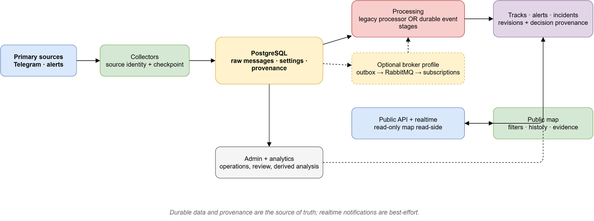

# Puluj-g

## Quick Start: Docker

З кореня репозиторію запустіть інтерактивний майстер:

```powershell
pwsh scripts/deploy.ps1
```

Він дозволяє вибрати сервіси для публікації, перебудову образів, збереження,
створення або повне очищення ізольованої БД, стандартний messaging pipeline і потрібні токени,
Telegram API ID/API hash/номер/2FA та LLM-конфігурацію. Секрети не виводяться.
Для наявної БД майстер окремо пропонує записати runtime-параметри в
`app_settings`, бо вони мають пріоритет над `.env`.

Для часткової публікації, наприклад лише `admin`, майстер ставить тільки
питання про вибраний компонент і запускає його з `--no-deps`: він не чіпає БД,
міграції, колектори або messaging. Для нового середовища чи зміни схеми
потрібно окремо вибрати `migrate` або повний стек.

Для **першої навмисно порожньої інсталяції** в майстрі виберіть створення
нового volume, або скористайтеся неінтерактивною командою:

```powershell
pwsh scripts/deploy.ps1 -InitializeDatabase -NonInteractive
```

Після успішного запуску відкрийте публічну карту: <http://localhost:8090>;
admin-панель: <http://localhost:8091>. Перевірки доступності:
<http://localhost:8090/api/health> та <http://localhost:8091/api/health>.

Це інструкція до запуску, а не зафіксований результат runtime smoke для цього
checkout: Docker-стек у межах документаційної перевірки не запускався.

Для **наступного запуску або оновлення наявної БД** не створюйте новий том:

```powershell
pwsh scripts/deploy.ps1 -NonInteractive
```

Скрипт відмовиться непомітно ініціалізувати порожню БД. Якщо наявний том має
іншу назву, передайте її явно через `-DatabaseVolume <name>`. Перед оновленням
із ризиком для даних підготуйте перевірену резервну копію. Деталі про ролі,
конфігурацію, messaging pipeline і діагностику — у
[посібнику з розгортання та експлуатації](docs/deployment-operations.md).

## Що таке Puluj-G

Puluj-G збирає повідомлення з первинних джерел, зберігає їхнє походження,
обробляє їх у tracks та incidents і показує перевірний read-side на публічній
мапі. Адміністративний контур дає операторам інструменти для контролю джерел,
налаштувань, черг, runs і review.

Система допомагає перетворити потік повідомлень на керовані, простежувані
спостереження; вона не встановлює істину, точну геолокацію або
причинно-наслідковий зв'язок. Координати, precision, confidence і зв'язки є
даними report/policy, а не гарантіями. Від публічного об'єкта до raw message
зберігаються source, revision, правила/версії та decision reason, щоб висновок
можна було перевірити без домислювання відсутніх фактів.

## Як це працює

Первинні джерела надходять через колектори до durable messaging pipeline:
PostgreSQL outbox, RabbitMQ та окремі stages нормалізації, розбору і domain
writers створюють tracks, alerts та incidents з provenance. Застарілий
monolithic `processor` вимкнений за замовчуванням і доступний лише як явний
контрольований rollback. API віддає read-side і realtime-сповіщення публічній
карті, а admin і analytics працюють з операційними та похідними даними.



Редагована схема: [system-overview.drawio](docs/diagrams/system-overview.drawio).
Деталі: [колектори й ingestion](docs/collectors-ingestion.md),
[платформа обробки](docs/message-processing-platform.md),
[кореляція та provenance](docs/correlation-tracks-incidents.md),
[public API/read-side](docs/public-api-read-side.md),
[admin-процедури](docs/admin-operations.md) і
[аналітичний сервіс](docs/analytics-service.md).

## Документація за ролями

| Для кого | З чого почати |
| --- | --- |
| Користувач | [Публічна карта й приватність](docs/web-clients.md), [public API та evidence](docs/public-api-read-side.md) |
| Розробник | [Доменна модель і дані](docs/domain-data-model.md), [колектори](docs/collectors-ingestion.md), [обробка повідомлень](docs/message-processing-platform.md), [web-клієнти](docs/web-clients.md) |
| Оператор | [Розгортання й конфігурація](docs/deployment-operations.md), [admin-контур](docs/admin-operations.md), [analytics](docs/analytics-service.md) |
| Інтегратор | [Public API, realtime і контракти](docs/public-api-read-side.md), [provenance треків та incidents](docs/correlation-tracks-incidents.md) |

Повний навігаційний індекс, правила документації та реєстр схем — у
[docs/README.md](docs/README.md).
