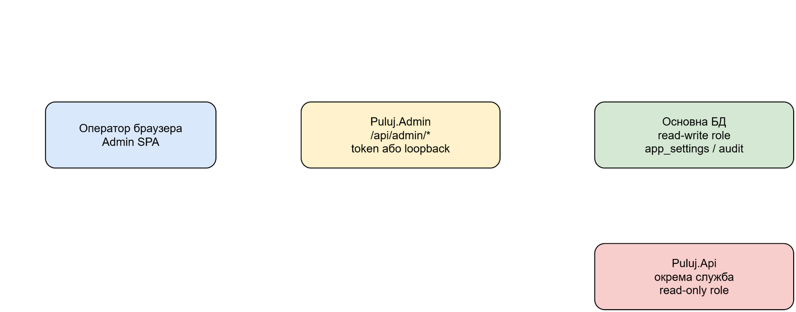
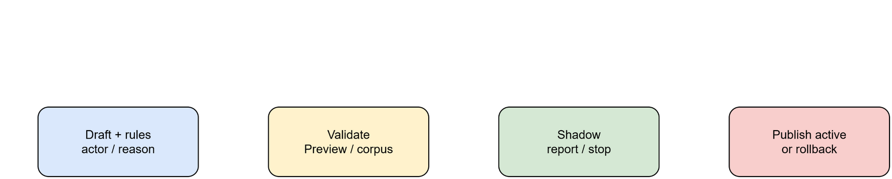
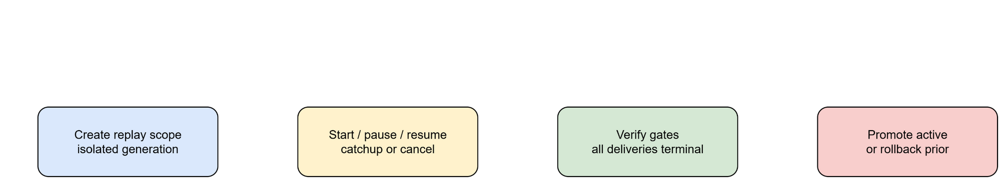
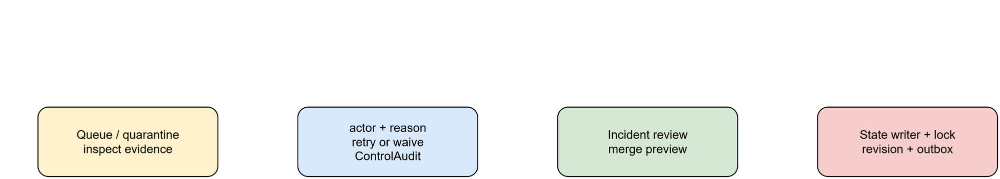

# Адміністративний контур і операційні процедури

## Призначення

`Puluj.Admin` — окремий операторський HTTP-сервіс і SPA для налаштування та спостереження. Він має read-write роль до основної БД; публічна `Puluj.Api` є окремою службою з read-only роллю. Адмін-клієнт збирається зі спільного `web/` у `src/Puluj.Admin/wwwroot` і працює з `/api/admin/*`.

## Доступ, межі та налаштування

Усі групи `/api/admin` проходять `AuthorizeAsync`. Якщо `Admin:Token` заданий, запит має містити `X-Admin-Token`; якщо ні — сервіс приймає лише loopback-запити для початкового налаштування. Це один токен, а не RBAC.

`GET/PUT /api/admin/settings` показує effective source (`db`, `config`, `default`, `none`) і редагує тільки allow-list `SettingsStore`. Секретні значення не повертаються. Зміна пишеться в `app_settings`, але не є гарантією миттєвого reload усіма процесами. Файли/environment — fallback для інфраструктури й секретів.

Джерела доступні через `/api/admin/sources`. Джерело зі збереженими raw повідомленнями не видаляється: його треба вимкнути, щоб не розірвати provenance. Поле токена лише приймається на запис; DTO повертає тільки `hasToken`.

Редагована схема: [admin-authority-boundaries.drawio](diagrams/admin-authority-boundaries.drawio).

## Операторські екрани й guardrails

Панель показує status, workers, collectors, pipeline, LLM usage, DB, логи та контейнери. SQL console (`POST /api/admin/ops/db/query`) приймає один `SELECT`/`WITH … SELECT`: без `;`, коментарів, `app_settings`, секретних назв і `pg_*`; виконання додатково відбувається в read-only транзакції з 10-секундним timeout і лімітом 200 рядків. У browser таблиць чутливі колонки маскуються.

Керування Docker доступне лише коли `Docker:Enabled=true`; сервіс перевіряє compose-проєкт, відмовляє protected services, обмежує scale allow-list і `MaxReplicas`, має timeout 60 с. Restart/stop/start/scale змінюють виконання сервісів; їхній запис — application log з IP, а не `ControlAudit`. Перед дією перевіряють доступність і стан, після — health/list/logs. HTTP 200 не є доказом завершення downstream-роботи.

`POST /api/admin/ops/reprocess` вимагає точного `REPROCESS_DERIVED_DATA`, відмовляє при paused processing і скидає похідні дані/індекс аналітики для повторної побудови. Це не скасовує raw-повідомлення, але змінює derived result: перед ним потрібні scope, backup та перевірка pipeline.

## Правила, черги, інциденти й replay

Ruleset API реалізує draft → replace rules → validate → preview/corpus → shadow → publish, а також stop shadow і rollback. Усі мутації потребують `actor` і `reason`; `RulesetService` аудіює їх. Preview/corpus не публікують версію; порожній corpus є помилкою. Publish може повернути 422, а неправильний стан/гонка — 409; rollback робить версію active, тож потрібна перевірка active version і worker reload.

Редагована схема: [ruleset-change-lifecycle.drawio](diagrams/ruleset-change-lifecycle.drawio).

Replay runs (`/api/admin/ops/runs`) мають state machine create/start/pause/resume/cancel/catchup/verify/promote/rollback. Кожна команда вимагає actor/reason та аудіюється; state/gate conflict — 409. Replay має ізольовану generation. `verify` не перемикає generation; `promote` змінює active generation, `rollback` повертає попередню. UI попереджає: force-promote може приховати позасcope active incidents до наступного replay.

Редагована схема: [run-replay-lifecycle.drawio](diagrams/run-replay-lifecycle.drawio).

Messaging lanes переводяться між `active`, `paused`, `draining`; retry і waive карантину також вимагають actor/reason та створюють `ControlAudit`. Retry публікує роботу через outbox, waive завершує конкретну нерозв'язану карантинну подію. Incident commands (resolve/retract/confirm/suppress/unsuppress/merge/split) проходять locked `IncidentStateWriter`, пишуть revision з actor/reason і відмовляються без outbox. Merge preview — read-only plan; команда може бути відхилена за stale revision або state rules.

Редагована схема: [quarantine-incident-operator-flow.drawio](diagrams/quarantine-incident-operator-flow.drawio).

## Перевірка і межі

Контракти та відмови перевіряють `tests/Puluj.Admin.Tests` (rulesets, incidents, workers, Docker і `DatabaseQueryGuard`), UI-потоки — `web/e2e/A01-admin.e2e.ts`, `A03-queues.e2e.ts`, `A05-replay.e2e.ts`, `A06-lifecycle.e2e.ts`. Токени й секрети не наведено. Settings, sources, reprocess і Docker не мають persistований actor/reason audit у коді; це обмеження реалізації, а не обіцянка документації.
