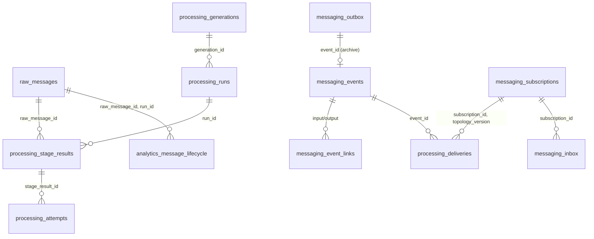

# ADR-0006 — Логічна модель даних `messaging.*`, `processing.*`, `analytics.message_*`

Статус: **proposed** (P01). Рівень — **логічний**: таблиці, natural/unique keys, ownership, retention class.
Колонки — proposal; типи, індекси (за `EXPLAIN` на production-shaped даних), міграції — власники P03 (messaging/processing)
і P15 (analytics). Вимоги: plan §5.2, §10, §12 (analytics lifecycle schema у хвилі 1), §15.2.

## Принципи

- Inbox/outbox належать БД, де етап змінює свій результат. Analytics живе у тій самій PostgreSQL
  (схема `analytics`, `AnalyticsDbContext`), тому має власні `inbox`, без distributed transaction.
- Додаткові схеми `messaging`, `processing` — additive; існуючі таблиці не перейменовуються у P03.
- Broker ACK і DB commit не атомарні; receipts збираються асинхронно, без глобального бар'єра на ACK.
- Append-only там, де це evidence (`events`, `attempts`, `deliveries` receipts); rebuildable там, де проєкція.

## ERD

## Таблиці

### `messaging` (owner P03)

| Таблиця | Ключі / access-path hints (proposal, індекси остаточно — P03 за EXPLAIN) | Призначення / колонки (proposal) | Retention |
|---|---|---|---|
| `messaging.outbox` | PK `event_id`; index `(confirmed_at NULL, next_attempt_at)` | Подія для гарантованої публікації: envelope (jsonb), routing_key, lane, `created_at`, `lease_owner`, `lease_until`, `attempts`, `next_attempt_at`, `last_error`, `confirmed_at` | Cleanup **лише** після archive receipt для `replay_source` подій (§15.2); інакше — після confirm + grace |
| `messaging.inbox` | unique `(subscription_id, event_id)` | Consumer dedup; `received_at`, `completed_at`, `outcome`; запис у транзакції результату | За підпискою: ≥ max redelivery window (proposal 30 днів) |
| `messaging.events` | PK `event_id`; index `(correlation_id)`, `(raw_message_id, run_id)`, `(event_type, published_at)` | Архів envelope + `payload`/`payload_ref` (append-only); джерело replay/backfill нових підписок | За policy (ADR-0007); ніколи не коротше за raw retention для `replay_source` |
| `messaging.event_links` | unique `(output_event_id, input_event_id)` | Causal links для batch результатів (багато входів → один вихід) | = events |
| `messaging.subscriptions` | PK `(subscription_id, topology_version)` | Версіонований registry (копія `topology.json` при deploy): bindings, lanes, required, queue_policy, status (`planned/active/paused/retired`), `activated_at`, `waiver` | Назавжди (малий) |
| `messaging.topology_versions` | PK `topology_version` | Хеш `topology.json`, `applied_at`, `applied_by` | Назавжди |

### `processing` (owner P03; stage_results/attempts — P05/P06)

| Таблиця | Ключі / access-path hints (proposal) | Призначення / колонки | Retention |
|---|---|---|---|
| `processing.runs` | PK `run_id`; index `(lane, state)` | ADR-0005: `lane`, `kind (live/history/replay)`, `state`, `generation_id`, `supersedes_run_id`, `replays_run_id`, versions jsonb, scope jsonb (sources, interval, stages), `checkpoint` jsonb, `created_by`, timestamps | Назавжди |
| `processing.generations` | PK `generation_id`; one row `is_active` per domain | Набір доменних результатів; `promoted_at`, `rolled_back_at`, `verified_by` | Назавжди |
| `processing.stage_results` | unique `(raw_message_id, run_id, stage, stage_version)` | `outcome`, `outputs` jsonb (event_ids, extraction_result_id), `started_at`, `finished_at`, `worker`, `versions` | Live: = raw; replay non-promoted: policy |
| `processing.attempts` | PK `attempt_id`; index `(stage_result_id)`, `(job_key, fencing_token)` | Кожна спроба: `worker`, `lease_until`, `fencing_token`, `state (running/interrupted/failed/succeeded/superseded)`, `error`, `retry_reason`, `retry_of_attempt_id`, timing | Proposal 90 днів |
| `processing.deliveries` | unique `(event_id, subscription_id)` | Expected/terminal receipts: `topology_version`, `expected_at`, `outcome (completed/noop/quarantined/waived)`, `completed_at`, `reason`, `actor`, `attempt_id` | = events для replay_source; інакше 90 днів |
| `processing.quarantine` | PK `quarantine_id`; index `(subscription_id, event_id)` | Payload/помилка для DLQ receipts, `resolved_at`, `retry_run_id` | До розв'язання + 90 днів |

Legacy `raw_messages.processing_status`, `claimed_by`, `attempts` лишаються compatibility-проєкцією до P05/P14.

### `analytics.message_*` (owner P15; проєктується тут, щоб не втратити lifecycle під час переходу)

| Таблиця | Ключі | Призначення |
|---|---|---|
| `analytics.message_lifecycle` | unique `(raw_message_id, run_id)` | Одна стрічка проходження: `source_id`, `source_message_key`, `source_revision`, `lane`, `source_published_at`, `received_at`, `stored_at`, `normalized_at`, `parsed_at`, `llm_completed_at`, `analyzed_at`, `domain_completed_at`, `visible_at`, `outcome`, `method`, `fact_count`, `expected_branches`, `needs_attention`, `versions`; **upsert часткового запису** при out-of-order (ADR-0004 W14b), `unavailable` (NULL + flag) для історичних timings, яких не збирали |
| `analytics.message_stage_timings` | unique `(raw_message_id, run_id, stage)` | wait/processing тривалості за стадією для p50/p95/p99 |
| `analytics.message_receipts` | unique `(event_id, subscription_id)` | Проєкція deliveries для «хто чекає/завершив/помилився» |
| `analytics.source_daily` | unique `(source_id, day, lane)` | Пости/редакції/forwards, live vs history, затримка збору, перерви |
| `analytics.parse_daily` | unique `(day, source_id, method, outcome, rules_version, model)` | Rules vs LLM, no_facts/unknown/unsupported/multi-fact/unlocated |
| `analytics.cost_daily` | unique `(day, model, stage)` | Tokens/cost/cache/retries/latency |
| `analytics.similarity_*` | (існуючі copies/fingerprints) | Допоміжний розділ; legacy таблиці видаляються окремим етапом |

Правила: root message count рахується один раз на `raw_message_id` (не на run/редакцію); знаменники
(отримано / розібрано / фактів / deliveries) — окремі колонки; сховище — UTC, UI — Europe/Kyiv.

## Ідемпотентність за таблицею

| Writer | Ключ ідемпотентності |
|---|---|
| raw-writer | unique `(source_id, source_message_key, source_revision)` → існуючий id, `is_new:false` |
| stage consumers | `messaging.inbox (subscription_id, event_id)` + `stage_results` unique |
| finalizer | `stage_results (raw, run, 'extraction', version)` — рівно один канонічний extraction на run |
| domain workers | inbox + `aggregate_revision` (optimistic) або lock за стратегією P09 |
| archive | `messaging.events` PK `event_id` |
| analytics | upsert `(raw_message_id, run_id)`; агрегати — recompute з lifecycle rows, не інкремент |

## Rollback / міграція (для P03/P15)

- Усі об'єкти additive у нових схемах; rollback = не читати їх (legacy шлях лишається).
- `messaging.subscriptions` заповнюється з `topology.json` при deploy; розбіжність hash → alarm.
- Індекси — за `EXPLAIN (ANALYZE, BUFFERS)` на production-shaped копії; concurrent builds поза EF transaction.

## Відкрите

| Питання | Задача |
|---|---|
| Типи колонок, індекси, партиціювання `events`/`deliveries` за часом | P03 |
| Analytics DDL, backfill з legacy `raw_messages`/`processing_errors`, позначення `unavailable` | P15 |
| Розмір `payload` в `events` vs `payload_ref` до blob | P04 |
