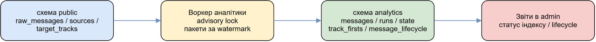
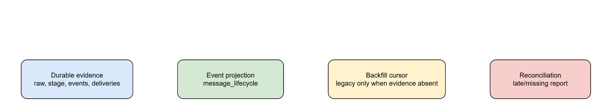
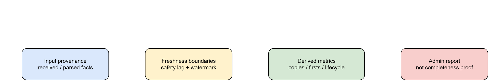

# Аналітичний сервіс і життєвий цикл повідомлень

## Призначення і межа схеми

`Puluj.Analytics.Worker` мігрує й обслуговує схему `analytics`; її history — `analytics.__EFMigrationsHistory`. `Puluj.Analytics` читає `raw_messages`, `sources`, `targets` та processing/messaging дані через SQL, не мапуючи їх як власні EF-сутності. Виняток — `analytics.message_lifecycle`: DDL належить migration основного `PulujDbContext`, а analytics worker її читає/оновлює.

Відкривайте цю сторінку, коли потрібно пояснити цифру у звіті або безпечно
запустити backfill/reconciliation. На виході аналітика дає похідний звіт із
посиланням на наявні докази; вона не встановлює першоджерело і не гарантує
повноту даних у реальному часі.

Редагована схема: [analytics-data-flow-schema-boundary.drawio](diagrams/analytics-data-flow-schema-boundary.drawio).

## Індекс повідомлень і звіт

Воркер бере `raw_messages` за зростанням ID, старші за `Analytics:SafetyLag`,
і в одній транзакції записує індекс та новий watermark. PostgreSQL advisory lock
не дає двом інстансам виконувати один прогін. Після збою незакомічений пакет
повторюється; це не гарантія «рівно одного» звернення до зовнішньої системи.

Індекс містить відомості про повідомлення, потрібні для стану воркера і
`track_firsts`. `track_firsts` періодично перебудовується за налаштованим
періодом. Аналітика не визначає копії,
першоджерело, пари джерел або рейтинг джерел; схожий текст сам по собі не є
таким контрактом.

Read-only admin API `/api/admin/analytics/status` показує watermark, backlog,
heartbeat, прогін та стан інстансу. Значення залежать від надходження даних і
watermark, тому не гарантують повноту або актуальність у реальному часі.

## Lifecycle projection, backfill і reconciliation

`analytics.message_lifecycle` поєднує durable evidence: root з raw, analysis з extraction/stage/observation, domain completion з archived events/deliveries, зв'язки incident/track/alert та LLM cost. Запис має `run_id` і `source_of_truth`; невідоме лишається unknown. Історичний raw без stage/events і старший за grace потрапляє до synthetic `legacy` run з недоступними timing/completion, а не з вигаданими значеннями. Backfill не перезаписує event-sourced values: заповнює лише порожні поля або upsert-ить root.

Редагована схема: [message-lifecycle-projection-reconciliation.drawio](diagrams/message-lifecycle-projection-reconciliation.drawio).

Worker у кожному циклі виконує bounded backfill за cursor, потім sweep reconciliation у recent window. Cursor — це технічний `raw_message_id` для keyset-обходу з можливими пропусками, а не кількість повідомлень: у статусі прогрес показано як точне `проєкційовано / усі повідомлення`. Reconciliation лічить raw/posts/edits проти projection, backfill-ить не більш як 2000 missing roots за раз і заповнює late analysis/domain completion лише за наявними durable records. Вона не доводить повноту джерела і може відобразити затримку delivery/event.

`POST /api/admin/analytics/lifecycle/backfill` і `/reconcile` потребують actor/reason та записують `ControlAudit`; `backfill?reset=true` скидає cursor, але не видаляє rows. Це write-операції з можливими DB load, зміною derived view та конкуренцією з worker. Спершу оцінюють status/progress, після — reconciliation report; відповідь API не означає завершення всієї історії.

Редагована схема: [analytics-report-provenance-freshness.drawio](diagrams/analytics-report-provenance-freshness.drawio).

## Перевірка і межі

`tests/Puluj.Analytics.Tests` перевіряє runner, індекс, `track_firsts` і lifecycle;
`web/e2e/A06-lifecycle.e2e.ts` перевіряє операторський lifecycle UI.
`POST /api/admin/analytics/reset` видаляє незалежний індекс і `track_firsts`,
після чого повертає watermark для повторної побудови. Endpoint існує, але не
вимагає actor/reason і не пише `ControlAudit`, тому це не безпечна рутинна дія.
