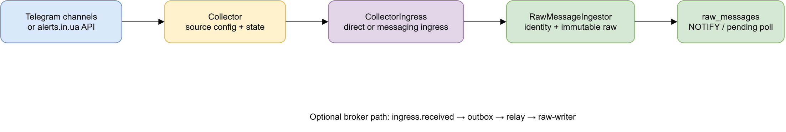
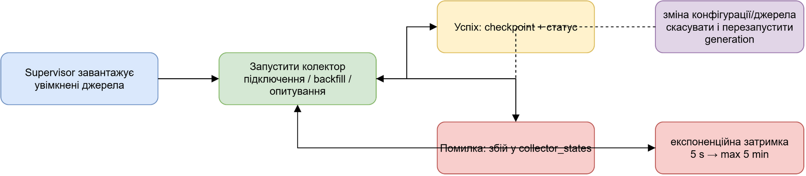
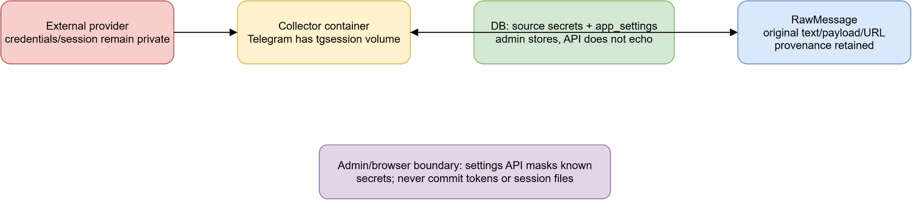

# Колектори, ingestion і первинні джерела

## Призначення

Колектори перетворюють зовнішній допис або структуровану відповідь на
`IncomingMessage`, а ingestion зберігає оригінал як `RawMessage`. Нормалізація,
парсинг та доменні події є наступними похідними етапами і не підміняють
первинний payload/text.

Користуйтеся цим описом, коли додаєте джерело або шукаєте, де зникло
повідомлення. Успішний результат цього етапу — raw-повідомлення з джерелом,
стабільним ключем і збереженим оригіналом; поява об'єкта на карті потребує ще
наступних етапів обробки.

## Джерела та шлях даних

У `sources` зберігаються code, тип, URL, trust level, priority, enabled,
source-specific config і secrets. `CollectorSupervisor` бере лише enabled
джерела, упорядковує їх за priority та передає кожному колектору ті, які він
обробляє. Зміна enabled-набору або відстежуваних config/secrets/polling значень,
а також relevant collector options, перезапускає колектори з новою
конфігурацією без перезапуску процесу.

Telegram collector працює для Telegram sources з username у config. Він
зберігає нові й відредаговані channel posts: edit має ту саму key, але окрему
revision, тому оригінал не втрачається. alerts.in.ua полить active alerts і
формує start/end повідомлення зі стабільними ключами `{id}:start` та
`{id}:end`. Для обох шляхів `RawMessageIngestor` зберігає наявні оригінальні
text/payload і URL, рахує latency та будить processor через PostgreSQL `NOTIFY`;
poll Pending рядків покриває втрату notification.

За звичайного шляху `RawMessageIngestor` пише прямо у `raw_messages`. Коли
увімкнено Messaging ingress, collector комітить `ingress.received` та
checkpoint в outbox, після чого `relay` і `raw-writer` мають доставити подію
до raw table. Якщо цих ролей немає, Worker лише попереджає: повідомлення ще
не потрапляють у `raw_messages`.

Редагована схема: [ingestion-flow.drawio](diagrams/ingestion-flow.drawio).

## Стан, retry та відновлення

Кожний collector запускається supervisor-ом у власній task. Помилка одного
колектора не зупиняє інші: supervisor повторює його з exponential backoff від
5 секунд до 5 хвилин; після понад 10 хвилин healthy run backoff скидається.
`collector_states` фіксує polling/success, останній message time/id, cursor,
error (до 2000 символів) і послідовні помилки. Це operational state, а не
заміна raw provenance.

Telegram recent backfill використовує останній source message id. Якщо задано
`BackfillSince`, керований scheduler читає повну історію сторінками по 100:
кожен прохід бере лише одну сторінку і повертає source у weighted round-robin
кільце. Вага — `clamp(sources.priority, 1..10)`, тому важливий канал отримує
більше слотів, але не може витіснити інші. Є не більш як два workers і один
глобальний request gate: стартово один history RPC кожні 500 ms; `FLOOD_WAIT`
ставить cooldown для всіх каналів, подвоює інтервал до максимуму та після 30
хвилин без flood поступово зменшує його.

Стан `history` у `collector_states.cursor` versioned і містить `since`,
`lastId`, `stored`, `pages`, `done`, `nextAttemptAt`, flood/error metadata.
Старий cursor без `version` читається як v1, тому restart не починає import
спочатку. Кожен RPC має 30-секундний timeout; оскільки WTelegram RPC не
скасовується токеном, timeout припиняє scheduler і передає session supervisor-у
контрольований restart, а cursor залишається на попередній безпечній сторінці.
Після timeout request gate позначає session poisoned і не запускає жодного
наступного RPC, доки supervisor не створить новий client. Permanent history RPC
errors (400/403/404, зокрема private або revoked канал) завершують лише це
джерело з помилкою в `collector_states`; вони не залишають processing на паузі.

`UpdateManager` стартує до scheduler-а: live posts та edits негайно durable
ingest-яться з тією самою raw identity, навіть коли history триває. Existing
safe ordering semantics лишають derived processing на паузі до history drain і
rebuild у publication order; це не означає втрати live даних. Binary media не
завантажуються під час history: зберігається лише metadata в raw payload.
Takeout не є автоматичним fallback: його можна додавати лише окремим explicit
initial-import режимом із власним session lifecycle та операційним canary.

Редагована схема: [collector-lifecycle.drawio](diagrams/collector-lifecycle.drawio).

## Telegram session і секрети

Для Telegram потрібні `ApiId`, `ApiHash` і телефон, а session path за
замовчуванням — `session/puluj.session` (у Compose це том `tgsession`). За
відсутніх або некоректних credentials колектор лишається idle та пише runtime
status, а не намагається працювати з частково налаштованою сесією. Перший код
входу можна подати через admin setting, configuration або тимчасовий файл
`<SessionPath>.code`; код видаляє цей файл після читання, а DB-значення коду
очищає після використання.

У production застосовуйте секрет-сховище/захищені значення середовища або
контрольований admin workflow. Не комітьте `ApiHash`, пароль, verification
code, bearer token, `.session`, `.updates` чи `.code`; не вставляйте їх у
issue, log або документацію. API admin приховує позначені секретні settings,
а source secrets не віддаються браузеру.

Редагована схема: [collector-data-boundaries.drawio](diagrams/collector-data-boundaries.drawio).

## Як додавати колектор

Новий колектор реалізує `ICollector`, однозначно визначає, які enabled
`Source` він обробляє, і передає до `CollectorIngress` або
`RawMessageIngestor` первинні поля `IncomingMessage`: source ID, стабільну
message identity, published time, оригінальний text/payload та URL за
наявності. Identity має відрізняти revision від нового поста. Checkpoint треба
комітити разом із повідомленням там, де це підтримує ingress, щоб crash не
перестрибнув непереданий запис.

Не використовуйте content hash як дедуплікацію між різними повідомленнями:
він є індексом схожості. Не перетворюйте source text на нормалізований факт до
збереження raw. Додайте роль Worker, DI-реєстрацію, конфігураційні ключі й
перевірки відповідно до фактично потрібної інтеграції; не оголошуйте підтримку
нового джерела лише через seed row.

## Відомі межі

- `AlertsInUa:BackfillPeriod` описано кодом як разове history load; доступна
  глибина залежить від API, а не гарантується документацією.
- Telegram AutoJoin застосовується лише для public channels, які вдалося
  resolve; неуспішний канал позначається станом помилки та не вимикає інших.
- Trust level — атрибут джерела, не автоматичне підтвердження незалежності
  повідомлень або географічної точності.
