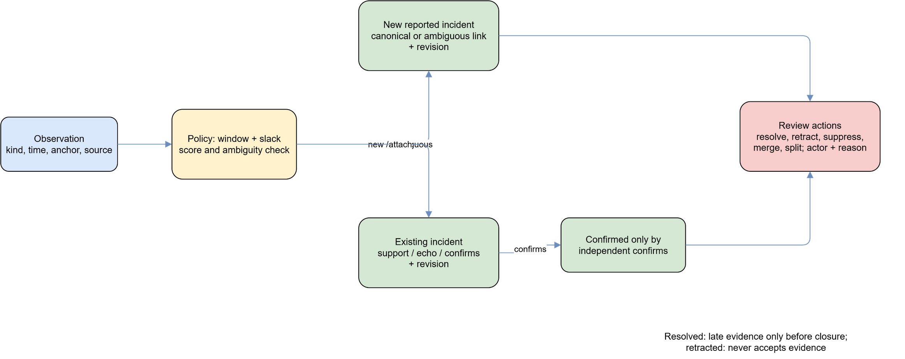
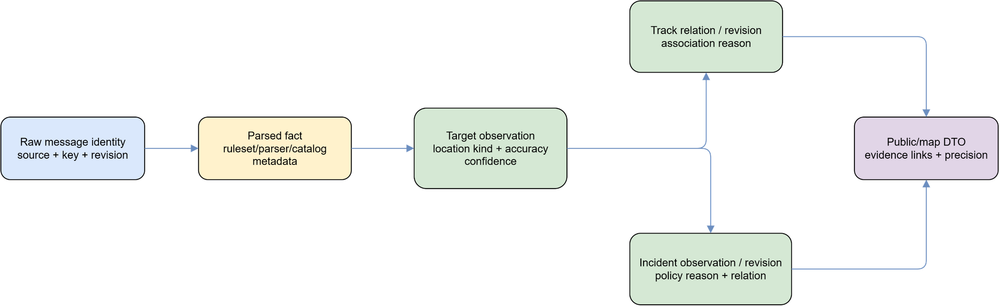

# Кореляція, треки, інциденти і provenance

## Призначення

Ця сторінка описує, як Target стає кандидатом для `TargetTrack` і як observation
стає доказовим зв'язком `Incident`. Кореляція є рішенням за policy та наявними
даними, а не доведенням тотожності об'єктів чи подій.

## Target і кореляція треків

`TargetBuilder` бере parsed fact, source trust і gazetteer. Він зберігає
ідентифікацію, parser/rule metadata, observed time, source та location kind /
accuracy. Центр великої області або destination approach не означає точне
фізичне положення. Якщо location немає, score не отримує штучного географічного
підтвердження.

Спершу `Correlator` відкидає несумісні category, різні explicit class/model та
неможливий простір. Кандидати шукаються в configurable
`Correlation:CandidateWindowMinutes` (default 120); скоринг користується
class-profile window/speed, `SlackKm` (default 30), часом, gap між geometry,
direction і class. Best candidate потребує score ≥ `AttachThreshold` (0.6) і
строгу перевагу над runner-up > `AmbiguityMargin` (0.05). Інакше створюється
новий track; deterministic ID ordering існує для діагностики, не створює
доказовості.

Редагована схема: [correlation-decision.drawio](diagrams/correlation-decision.drawio).

Duplicate window (default 3 minutes) обробляє повтори окремо від candidate
window. Association reason зберігає score components, тому рішення можна
аудитувати. Зміна policy/config впливає на наступну обробку; історичні рішення
не переписуються заднім числом.

## Життєвий цикл треку і ревізій

Track writer створює або оновлює `TargetTrack`, пов'язує Target і додає
`TargetTrackRevision`. Revision є recorded snapshot стану після доменної дії;
він не ретроспективно змінює попередній snapshot. Confidence треку зростає від
найкращої confidence з додатком за незалежні sources і кількість targets,
обмежується Low..High. Geometry поповнюється лише за правилами точності, тому
лінія є поданням reports, а не виміряною траєкторією.

Watchdog з інтервалом `Correlation:WatchdogInterval` (default 1 minute) закриває
active tracks після `CloseAfterWindows` (default 2) кореляційних вікон без
update. Закриття також створює revision та event; воно не доводить, що об'єкт
зник, лише завершує актуальний track за timeout policy.

Редагована схема: [track-lifecycle-revisions.drawio](diagrams/track-lifecycle-revisions.drawio).

## Інциденти, review і state transitions

Incident writer працює з versioned `IncidentPolicy` (`incident-1`). Per-kind
`event_kinds.dedup_policy` визначає `windowMinutes`, `slackKm`, `confirms`; якщо
її немає, default — 120 min / 5 km. Кандидат мусить бути того самого kind або
допустимого confirming kind, у time window та spatially compatible. Без geometry
дозволяється тільки exact same `placeId`: близькість не вигадується. Score =
0.6×time + 0.4×space; threshold 0.55, ambiguity margin 0.1. Близькі, але
несумісні кандидати й близькі score лишаються для review, а не merge.

`reported → confirmed` відбувається автоматично тільки від незалежного
`confirms`. `resolved` бере лише late evidence до closure і не reopen-иться;
`retracted` не приймає evidence. Операторські actions confirm, resolve, retract,
suppress/unsuppress, merge і split мають actor/reason, перевіряють conflict та
створюють revisions. Merge/retract/split не стирають observation provenance.

Редагована схема: [incident-lifecycle-review.drawio](diagrams/incident-lifecycle-review.drawio).

## Provenance і межі інтерпретації

Ланцюжок зберігає raw message identity `(SourceId, SourceMessageKey,
SourceRevision)`, source, rule/parser versions, observation IDs, association /
incident decision reason, canonical/support/echo/ambiguous relation і revisions.
Public DTO дає provenance, evidence links, source IDs та precision. Зв'язок
показує рішення політики за доступними reports, не встановлює причинно-наслідковий
зв'язок. Coordinate/accuracy можуть бути null, region, area, district або
direction-only; споживач не має зводити їх до точного point.

Редагована схема: [provenance-read-side.drawio](diagrams/provenance-read-side.drawio).

## Перевірка і межі

`P00ConcurrencyTests`, `DomainWriterTests` і `IncidentWriterTests` охоплюють
конкурентність, revisions, dedup/replay, independent replicas та review actions.
Числа вище є defaults/fixed policy у поточному коді; deployment може перевизначити
configurable `Correlation` і per-kind dedup policy. Не інтерпретуйте score як
ймовірність або доказ.
