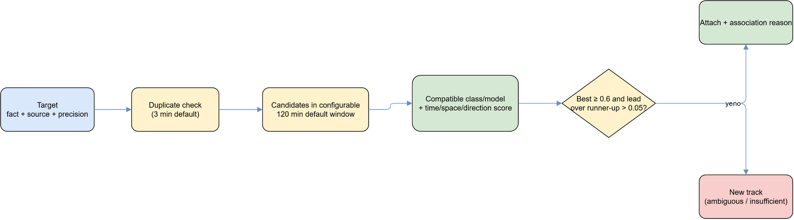
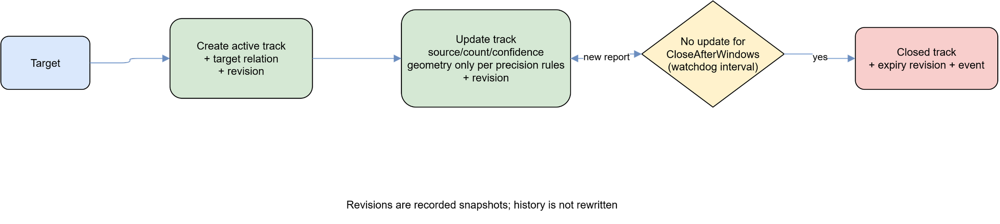

# Кореляція, треки та provenance

Processor перетворює придатні `targets` на треки без проміжної платформи доставки. `Correlator` підбирає кандидати за типом, часом, напрямком і географією; `CorrelationSink` у тій самій БД-транзакції записує зв'язок, оновлює трек і додає `target_track_revisions`.

Score — це детермінована оцінка policy, а не статистична ймовірність. Неоднозначний результат зберігається як зв'язок між targets і не дає права вигадувати точне місце чи тотожність об'єкта.

`TrackWatchdog` закриває застарілі треки за event time. Історична карта читає append-only revisions, тому повторне опрацювання старого повідомлення не повинно пересувати поточний маркер назад у часі.

Редагована схема: [correlation-decision.drawio](diagrams/correlation-decision.drawio).

Редагована схема: [track-lifecycle-revisions.drawio](diagrams/track-lifecycle-revisions.drawio).
