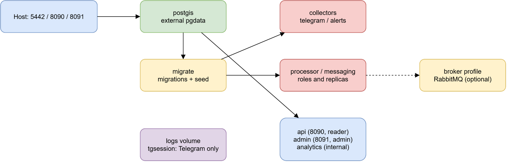
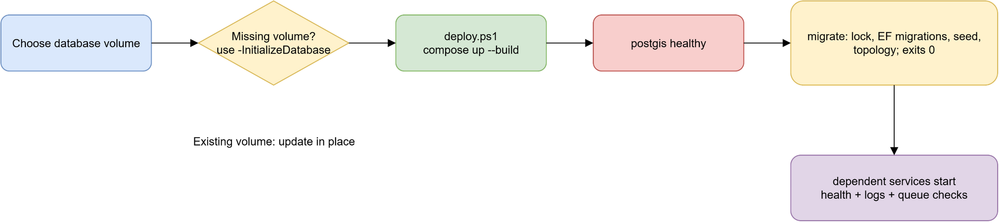
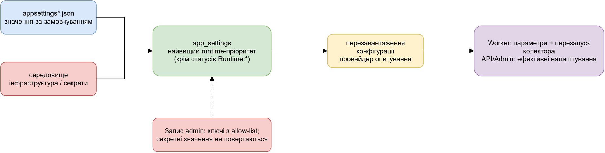

# Розгортання, конфігурація та експлуатація

## Призначення

Ця сторінка описує поточний Compose-запуск Puluj-G, робочі ролі та безпечні
операційні перевірки. Вона не є рецептом для публічного розміщення admin
панелі: її доступ і облікові дані повинні бути обмежені середовищем
розгортання.

## Топологія та межі доступу

Compose-проєкт має ім'я `puluj-g`. `postgis` зберігає дані у зовнішньому томі
`puluj-g-pgdata` (або значенні `PULUJ_PGDATA_VOLUME`) і є доступним з хоста на
`5442`. Публічна API має `8090`, admin — `8091`; analytics не публікує порт.
`logs` — спільний том журналів, а `tgsession` доступний лише Telegram
колектору. За профілем `broker` додається RabbitMQ з портами за змінними
`RABBITMQ_PORT` і `RABBITMQ_MANAGEMENT_PORT` (типові значення 5672 і 15672).

API працює від ролі `puluj_reader`; admin — від `puluj_admin`. Міграція
створює ролі й дані до запуску залежних сервісів. Admin-контейнер монтує
Docker socket для керування контейнерами саме цього Compose-проєкту. Це
root-еквівалентний доступ до хоста через сам socket, тому порт admin не можна
відкривати назовні; за потреби встановіть `Admin__Token` через безпечний
механізм середовища.



Редагована схема: [deployment-topology.drawio](diagrams/deployment-topology.drawio).

## Перший install і оновлення

З кореня репозиторію штатна команда — `pwsh scripts/deploy.ps1`. Скрипт
відмовляється непомітно створювати порожній PostgreSQL-том. Для навмисно
нової інсталяції потрібно явно вказати `-InitializeDatabase`; для наявних
даних лишають `-DatabaseVolume <наявний-том>` (за замовчуванням
`puluj-g-pgdata`).

```powershell
# лише перший, навмисно порожній install
pwsh scripts/deploy.ps1 -InitializeDatabase

# оновлення наявної БД
pwsh scripts/deploy.ps1
```

`migrate` — одноразова роль: бере advisory lock, застосовує очікувані EF
міграції, запускає seeders і реєструє топологію підписок, після чого
завершується. Інші сервіси очікують її успішного завершення. Скрипт збирає та
піднімає стек, чекає на `migrate`, а потім виводить статус контейнерів,
нещодавні помилки/блокування й пробує `http://localhost:8090/api/health` та
`http://localhost:8091/api/health`.

`-NoBuild` повторно використовує образи, `-Services` обмежує Compose-сервіси,
а `-SkipSql` пропускає дві одноразові SQL-корекції, які за замовчуванням
виконує скрипт. Це не заміна резервної копії: перед оновленням, що має ризик
для даних, зробіть і перевірте backup поза цим скриптом. У репозиторії немає
автоматизованого механізму backup/restore або rollback EF-міграцій, тому
відкат слід планувати як відновлення перевіреного тому/backup або окремо
перевірену операцію для конкретної міграції.

## Повний reset ізольованого розгортання

Це руйнівна, але явна операція для тестового або ізольованого Puluj-G deployment:

```powershell
pwsh scripts/deploy.ps1 -ResetDatabase -ConfirmReset
```

Без обох switch-ів скрипт не видаляє нічого. Перед дією він перевіряє точну пару
Compose project + database volume: за замовчуванням це тільки `puluj-g` і
`puluj-g-pgdata`. Для окремого ізольованого стенда назва project має починатися
з `puluj-g`, а том повинен точно збігатися з `<ComposeProject>-pgdata`, наприклад:

```powershell
pwsh scripts/deploy.ps1 -ComposeProject puluj-g-smoke -DatabaseVolume puluj-g-smoke-pgdata -ResetDatabase -ConfirmReset
```

Reset зупиняє лише цей Compose project, видаляє його non-external volumes
(`tgsession`, `logs`, RabbitMQ state) та точно перевірений PostgreSQL volume,
створює новий PostgreSQL volume, після чого запускає штатні EF migrations,
seeders, topology registration і health checks. Отже видаляються raw/derived
дані, треки, події, інциденти, alerts, replay/processing/messaging state,
collector cursors, watermarks, aggregates і `app_settings`. Також видаляються
DB-збережені source settings та Telegram session: після reset оператор заново
вводить секрети через безпечний канал; їх не виводить скрипт і не слід додавати
до звіту. Файлові/env значення лишаються fallback, але не замінюють відсутні
секрети автоматично.

Після успішного `migrate` перевірте health endpoints і зробіть один контрольний
ingest → processing → public/API read-side. Колектори починають без cursor та
watermark і виконують backfill за чинними налаштуваннями після повторної
конфігурації. Telegram та інші зовнішні API можуть не віддати старі дані через
retention, доступ, rate limits або історичні обмеження — reset цього не обходить.
Якщо скрипт зупинився, не вважайте reset успішним: виправте Docker/seed/migration
помилку і повторіть звичайний `pwsh scripts/deploy.ps1` для тієї самої ізольованої
цілі; новий volume без даних є безпечним кінцевим станом до успішної міграції.



Редагована схема: [deployment-lifecycle.drawio](diagrams/deployment-lifecycle.drawio).

## Ролі та режим broker

Один образ Worker запускається різними ролями: `migrate`, `telegram`,
`alerts`, `processing`; за broker-профілем — `relay`, `archive`,
`raw-writer`, `normalizer`, `parser`, `llm-worker`, `finalizer`, `projection`,
`replay`, `message-analytics`. Доменно-пишучі ролі (`track-worker`,
`alert-worker`, `watchdog`, `incident-worker`) вмикає
`pwsh scripts/deploy.ps1 -Broker -DomainWriters`.

Цей cutover перед запуском доменних writer-ів зупиняє та масштабує legacy
`processor` до нуля. Не запускайте `processing` разом із цими writer-ролями
проти однієї БД: код прямо відхиляє таку комбінацію в одному процесі, а
deploy-скрипт охороняє порядок зміни власника. Без `-Broker` платформа
повідомлень вимкнена і legacy processor лишається власником доменних записів.

## Ефективна конфігурація

`app_settings` є останнім провайдером конфігурації Worker, API й admin, отже
його ненульові ключі мають пріоритет над `appsettings*.json` та environment.
Провайдер перечитує таблицю приблизно раз на п'ять секунд; коли БД або таблиця
ще недоступна, він зберігає останню доступну конфігурацію. Ключі `Runtime:*`
не завантажуються як конфігурація: це статуси, які пишуть worker-и.

Файли та env лишаються fallback для поведінки до БД, а також каналом для
інфраструктурних параметрів (зокрема connection string, порти, томи) і
секретів. Admin UI дозволяє лише перелік ключів, позначає відомі секрети та
не повертає їх браузеру. Не додавайте реальні значення токенів, паролів або
Telegram session-файли до `.env`, `appsettings*.json`, документації чи Git.



Редагована схема: [runtime-configuration.drawio](diagrams/runtime-configuration.drawio).

## Діагностика

Почніть з `docker compose -p puluj-g ps`, журналу `migrate` та health endpoint-ів
вище. Для конкретного сервісу використовуйте `docker logs <контейнер>`;
спільні файлові журнали доступні в томі `logs`. Скрипт deploy також перевіряє
групи статусів `raw_messages`, а в broker-режимі — непідтверджений outbox і
delivery outcomes. Значення `Runtime:Worker:*` у `app_settings` — поточні
статуси для панелі, а не параметри, які слід вручну копіювати в конфігурацію.

## Відомі межі

- Healthcheck Compose визначено для PostGIS, RabbitMQ і analytics; API/admin
  надають `/api/health`, який deploy-скрипт опитує з хоста.
- У Compose типові паролі мають лише дев-значення. Це не безпечні production
  credentials і не повинні копіюватися як такі.
- Docker socket admin-панелі — окремий ризик, який не усуває перевірка
  Compose labels у коді.
