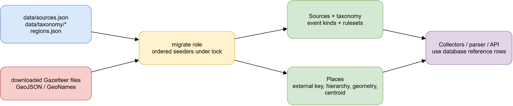

# Доменна модель, PostgreSQL/PostGIS і довідники

## Призначення

Puluj-G зберігає незмінний вхід (`raw_messages`) окремо від похідних фактів,
агрегатів. Нижче описано реалізовані сутності та схеми;
це не каталог запланованих таблиць.

Це довідник для розробника, який шукає власника даних або безпечний шлях до
доказу. Результат читання — розуміння, у якій схемі шукати дані й які записи є
первинними, а які можна перебудувати. Не використовуйте назву таблиці як
доказ точності місця, часу чи факту без пов'язаного provenance.

## Схеми та основні зв'язки

Основні доменні таблиці живуть у `public`: `sources` → `raw_messages` →
`targets`; `target_tracks` з'єднуються з фактами через `track_targets`, а
`target_track_revisions` зберігає snapshots треку. `target_links` фіксує
спрямований імовірнісний зв'язок між двома target. `air_alerts` посилається
на місце, джерело та (за наявності) raw start/end. Інциденти мають окремі
`incident_observations` та append-only `incident_revisions`.

Поруч з ними `collector_states` тримає cursor і health колектора,
`processing_errors` — помилки обробки, `llm_requests` — аудит LLM, а
`app_settings` — runtime settings.

Обробка спирається на `raw_messages.processing_status`; processor напряму створює
похідні доменні записи. Аналітика
власноруч мігрує схему `analytics`: `messages`, `track_firsts`, `runs`,
`state`; lifecycle-проєкція також зберігається як
`analytics.message_lifecycle`. Її поля з невідомим старим таймінгом лишають
`timings_available = false`, а не заповнюються вигаданими значеннями.

## Діаграма класів

Ця UML-діаграма показує скорочений зріз реалізованих класів домену: первинне
повідомлення, його канонічний результат аналізу, похідні факти, агрегати та
історичні snapshots. Вона не дублює повну ER-схему нижче: cardinality на
стрілках пояснює саме навігаційні/FK-зв'язки, важливі для provenance.

## Provenance, історичність та ідемпотентність

`RawMessage` містить оригінальний text/payload, URL, час публікації й прийому,
source identity та processing state. Після вставки змінюються лише
processing-поля. Ідентичність рядка — унікальна трійка
`(source_id, source_message_key, source_revision)`; hash — індекс схожості,
не заборона ще одного повідомлення. Повторна доставка повертає наявний raw ID
і не породжує нову подію у прямому ingestion-шляху.

Повторний аналіз оновлює похідний результат, не змінюючи оригінал у
`raw_messages`. Track і incident revisions зберігають історію після кожної зміни;
інцидентний зв'язок пояснює, чому observation належить агрегату.

Processor комітить діловий результат і завершує raw row в одній транзакції.
Повторний collector-ingest повертає наявний raw ID, а другий processor не може
одночасно отримати singleton-lock цієї бази.

## Географія та числові ідентифікатори

`places` використовує PostGIS (`Geometry`/`Point`, SRID 4326): адміністративні
одиниці мають MultiPolygon, населений пункт без меж — Point. `Centroid` і
`RadiusKm` описують coverage геометрії; це не дозвіл замінити семантичне
місце довільно точними координатами. `Target.Location` або
`Incident.Geometry` встановлюються лише з фактичного evidence; якщо його
немає, geometry може бути `null`. `LocationPlaceId` і `LocationKind` зберігають
семантичне місце окремо.

Доменні ідентифікатори raw/target/track/incident є `bigint` у PostgreSQL і
`long` у .NET. У frontend/API-клієнтах їх потрібно передавати та зберігати як
десяткові рядки: JavaScript `Number` не є безпечним для всього діапазону
`bigint`.

## Seed і межі власності

Роль `migrate` застосовує міграції під advisory lock, потім запускає seeders.
Seed sources, taxonomy і Gazetteer увімкнені за замовчуванням, але їх можна
вимкнути відповідними `Seed:*` опціями. Seeders додають/оновлюють довідкові
дані за стабільними ключами; джерелом runtime-стану є БД, а не файл seed.

Gazetteer читає комітований `regions.json` та локальні завантажені GeoJSON/
GeoNames файли. За відсутності потрібного файла відповідна частина імпорту
пропускається з warning; міграція від цього не отримує вигаданих місць.
Скрипти `scripts/gazetteer/download.ps1` і `scripts/gazetteer/download.sh`
підготовляють дані. Зовнішні ключі на кшталт `iso:*`, `cod:*`, `geonames:*`
та `area:*` підтримують відтворюване upsert-походження.

Редагована схема: [reference-data-flow.drawio](diagrams/reference-data-flow.drawio).

## Відомі межі

- `analytics` має власні міграції та owner-процес; основний `PulujDbContext`
  також створює lifecycle-проєкцію в цій схемі. Не змінюйте ownership через
  ручне DDL без узгодження обох міграційних потоків.
- Дані Gazetteer залежать від наявності завантажених файлів і їхніх ліцензій;
  `data/gazetteer/README.md` перелічує джерела й атрибуцію.
- `IndependentSourceCount` в Incident зараз не оцінюється кодом і лишається
  `null`, а не є лічильником каналів.
