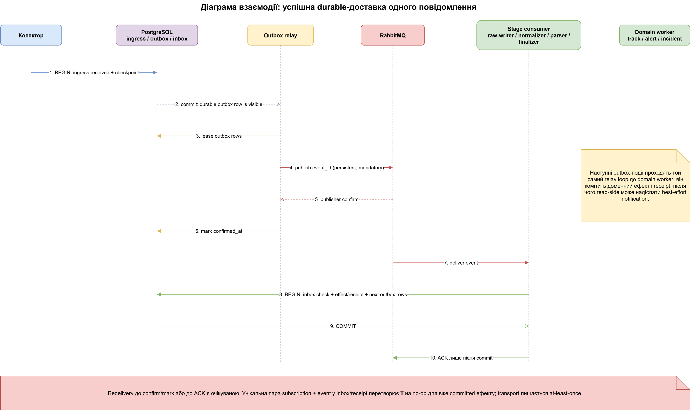
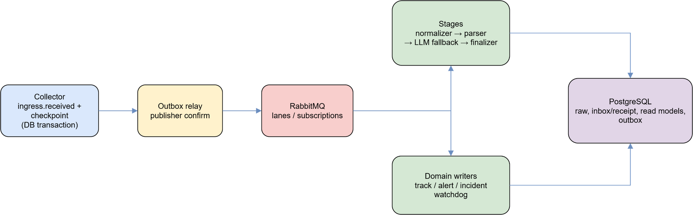
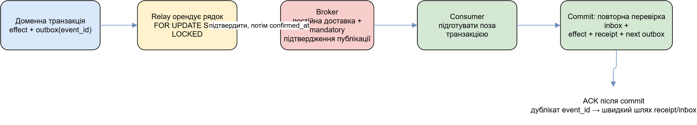
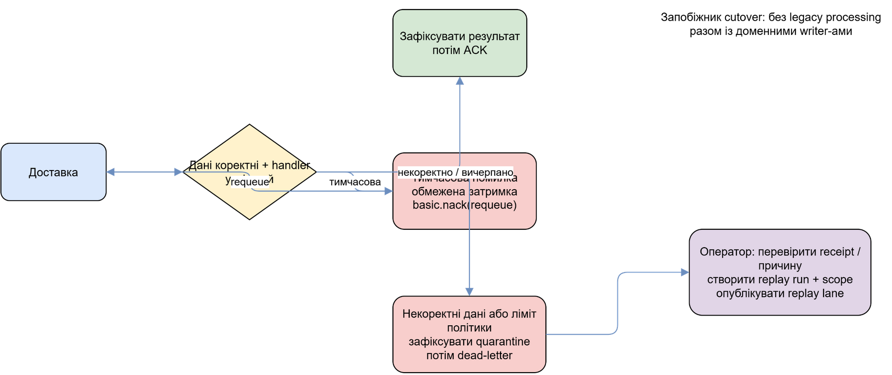
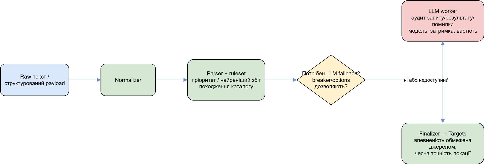

# Обробка повідомлень і платформа подій

## Призначення

Поточний production-pipeline переносить повідомлення колекторів через PostgreSQL,
`messaging.outbox`, RabbitMQ і subscription workers. Він відокремлює приймання
вхідних даних, нормалізацію/розбір, доменні записи, проєкції та операційний
контроль. `Puluj.Worker` запускає лише ролі, вказані у `Worker:Roles`; DB-backed
settings мають пріоритет над файлом конфігурації. Ролі broker вимагають
`Messaging:Enabled=true`.

Ця сторінка потрібна, щоб простежити шлях одного повідомлення та зрозуміти,
хто має право записувати похідні дані. Очікуваний результат — або зафіксований
наступний етап/доменний запис, або контрольована quarantine/retry-процедура.
Не запускайте legacy `processing` разом із domain writer-ролями для однієї БД.

## Діаграма взаємодії

Sequence-діаграма нижче фіксує часовий порядок успішної durable-доставки.
Вона показує критичну межу: consumer робить ACK тільки після коміту inbox,
ефекту та наступних outbox-подій. Повторна доставка до цього моменту є
нормальною властивістю at-least-once transport, а не окремим помилковим шляхом.

Редагована схема: [message-processing-interaction.drawio](diagrams/message-processing-interaction.drawio).

## Основний потік і межі транзакцій

Колектор фіксує `ingress.received` і checkpoint в одній БД-транзакції. Роль
`raw-writer` споживає цей event та фіксує raw row і наступні outbox rows; stages
`normalizer`, `parser`, `llm-worker`, `finalizer` послідовно створюють наступний
event. Domain writers (track, alert, watchdog, incident) є окремими durable
підписниками. Застаріла `processing` role claim-ить `raw_messages` у БД і
виконує монолітний processor. Вона вимкнена за замовчуванням: Compose запускає
durable messaging stages і domain writers. `processing` дозволена лише як
явний контрольований rollback і її не можна запускати разом з domain-writer
roles, щоб два власники не записували ті самі доменні рядки.

`RawMessageClaims` робить claim одним `UPDATE … FOR UPDATE SKIP LOCKED`: статус
переходить `Pending → InProgress`. Lease sweep повертає прострочений claim у
`Pending` або, після `Processing:MaxAttempts`, позначає `Failed`; штатне
завершення повертає незапущений claim без лічильника. Це дає взаємне виключення
на рядку, а не глобальний порядок: за concurrency > 1 і кількох instances
найстаріший порядок лише приблизний у межах паралельного вікна.

Редагована схема: [message-processing-pipeline.drawio](diagrams/message-processing-pipeline.drawio).

В одному stage-consumer handler готує дані поза короткою commit-транзакцією, а
потім у ній повторно перевіряє inbox, записує effect/receipt і всі похідні
outbox rows. Лише після commit він надсилає RabbitMQ ACK. Отже, підтвердження
доставки не є доказом того, що side effect уже видимий; ним є committed receipt.

## Durable event, retries і quarantine

Outbox relay lease-ить рядки `FOR UPDATE SKIP LOCKED`, публікує їх persistent та
mandatory і чекає publisher confirm. Він ставить `confirmed_at` тільки після
confirm. Падіння між confirm і mark може повторно опублікувати той самий
`event_id`; inbox/receipt призначені поглинути таку redelivery. Це **at-least-once
transport до ідемпотентного committed outcome**, а не exactly-once end-to-end і
не глобально впорядкований журнал. Unroutable publish чекає topology
declare/reconciliation, а timeout лишає lease до повторної спроби.

Редагована схема: [durable-event-lifecycle.drawio](diagrams/durable-event-lifecycle.drawio).

Consumer спершу перевіряє schema/inbox. Transient failure має bounded backoff і
`basic.nack(requeue=true)`; delivery тримається unacked. Невалідний input або
вичерпаний policy limit спочатку комітить quarantine outcome, а вже потім
dead-letters delivery. DLQ, quarantine й receipts є операційним слідом —
небезпечно вручну ACK/NACK або видаляти їх без зафіксованої причини.

Редагована схема: [retry-quarantine-replay.drawio](diagrams/retry-quarantine-replay.drawio).

Replay створюється як run/scope та публікується в `replay` lane. Перед запуском
оператор має перевірити scope, цільові subscriptions, generation і вплив на
read-side; replay lane не повинен виводити старі результати у live map. Cutover
потрібно виконувати без одночасного legacy `processing` і domain writers.
Реконсиляція/ops snapshot показують невідтверджений outbox, overdue delivery,
quarantine та topology; вони не замінюють виправлення bindings або worker roles.

## Stages, rules, LLM і аудит

Normalizer готує текст, parser застосовує current ruleset/event-kind catalog і
будує facts, finalizer матеріалізує targets. Rule resolution бере найвищий
priority, потім найраніший match і код; ruleset/version та event-kind policy
потрапляють у provenance. `TargetBuilder` обмежує confidence trust level source,
знижує hedged твердження та зберігає location kind/accuracy замість вигаданої
точки.

LLM worker — fallback stage, не безумовна істина: breaker/options і результат
визначають, чи він викликається; його запит, відповідь/помилка, модель, latency
та витрати мають audit record. Надалі finalizer застосовує той самий контракт
подій. Відсутність LLM-результату не дозволяє підміняти її припущенням.

Редагована схема: [rules-llm-decision.drawio](diagrams/rules-llm-decision.drawio).

## Legacy notification

`PgNotify`/`LISTEN` ще використовуються як best-effort live hint для legacy
claim queue і як API notification backplane. Втрата notification не втрачає
durable work: loop опитує `Pending` rows, а API надсилає `Resync` після reconnect.
Це не durable transport і не підстава заявляти ordering або delivery guarantee.

## Перевірка і експлуатація

- `tests/Puluj.Integration.Tests/P00ConcurrencyTests.cs` перевіряє claims, lease
  і concurrent writers; `tests/Puluj.Messaging.Tests/Integration` перевіряє
  outbox crash windows, consumer duplicate/quarantine та replay/lifecycle.
- Перед production action перевірте active roles, `Messaging:Enabled`, topology,
  worker status і reconciliation; для replay/quarantine вказуйте actor та reason.
- Схеми експортуються і перевіряються скриптами з
  [інструкції](diagrams/export.md).

## Відомі межі

Контракт стійкий до відомих redelivery crash windows завдяки event ID та inbox,
але не обіцяє exactly-once, порядок між queues або delivery у SignalR. Старий
monolithic processor лишається лише для явного rollback; він не є fallback за
замовчуванням і не є описом durable RabbitMQ pipeline.
