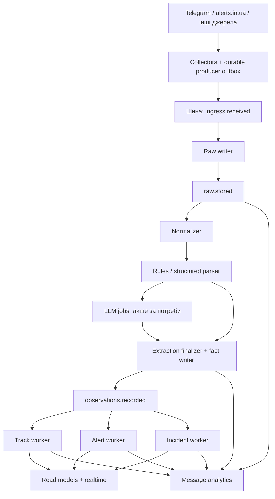

# Єдина платформа повідомлень, воркерів і подій

Дата: 2026-09-15. Статус: **план, реалізація нової архітектури ще не почалася**.

**Єдиний актуальний план програми.** Документ містить повні вимоги до черги, воркерів, блокувань,
розпізнавання, інших подій та інцидентів, карт, аналітики, міграції й експлуатації. Для виконання не потрібні
історія чатів або попередні плани. Старі файли планів залишаються лише покажчиками на цей документ.

Наведений стан коду — знімок робочого дерева на дату документа, не підтвердження deployment.
При розбіжності з кодом агент записує нове спостереження і коригує відповідну задачу. Не позначає
вимогу виконаною лише тому, що вона описана тут. Нові назви таблиць, подій і компонентів нижче —
проєктні контракти, якщо явно не сказано, що вони вже існують.

## 0. Як почати роботу без контексту автора

### 0.1 Мета та повноваження документа

Puluj-G збирає повідомлення з відкритих джерел, виділяє факти про повітряні загрози й інші події,
будує треки/інциденти та показує їх із походженням і чесною просторовою похибкою. Потрібно перейти
від одного послідовного store-етапу до незалежних надійних обробників і пояснювати долю кожного поста.

Цей файл — специфікація і робочий backlog. Його передача агенту для реалізації означає виконання
призначеної задачі та перевірок; саме читання плану не означає дозволу очистити БД, змінити production,
масово повторно викликати платний LLM чи надсилати зовнішні сповіщення. Обсяг запуску задає користувач
або координатор. Для підзадач не потрібно перечитувати чати.

### 0.2 Перші дії виконавця

1. Прочитати документ повністю, перевірити застосовні `AGENTS.md`, `git status --short` і diff власних файлів.
   Робоче дерево може містити незакомічені зміни інших агентів: не відкидати їх і не приписувати собі.
2. Взяти task ID із §15, зафіксувати власника, scope файлів, залежності й reviewer у таблиці §17.
3. Звірити поточний код за картою §0.4. Перевірити, які залежності реально інтегровані та протестовані.
4. Для змін схеми/контракту спочатку зафіксувати рішення й сумісність; міграції має один власник.
5. Зробити мінімальний наскрізний зріз, виконати task-specific checks і передати незалежному reviewer.
6. Записати результат, точні команди, середовище й невиконані перевірки за шаблоном §16. Оновити §17.

### 0.3 Словник

| Термін | Значення в цій програмі |
|---|---|
| Source message / raw | Оригінальний пост конкретного джерела й редакції; не результат парсингу |
| Transport event | Незмінне повідомлення шини, наприклад `raw.stored`; це не обов'язково подія на мапі |
| Observation / факт | Один витягнутий із поста факт; історична сутність `Target` містить також нетаргетні факти |
| Event kind | Доменний вид факту: вибух, ППО, початок тривоги; не тип транспортного envelope |
| Track | Агрегат повідомлень про рухому ціль, із власною історією |
| Incident | Агрегат фактів про одну статичну подію/наслідок, із доказами й ревізіями |
| Subscription / consumer group | Логічний тип зацікавленого обробника; усі його репліки ділять одну роботу |
| ACK / confirm | Відповідно підтвердження обробки consumer і прийняття публікації broker |
| Inbox / outbox | Dedup отриманих подій / надійний список подій, які треба опублікувати |
| Projection / read-side | Відновлюване представлення для API, мапи або аналітики |
| Run / generation | Конкретний запуск обробки / набір результатів, який можна зробити активним |
| Replay / backfill | Повторний розрахунок збереженого / дочитування історії з джерела |
| Gate / ADR | Умова приймання етапу / зафіксоване архітектурне рішення з мотивами |

### 0.4 Карта репозиторію

Шляхи нижче відносні до кореня репозиторію, де міститься `Puluj.sln`. На момент планування локальний
checkout — `C:\repos\Puluj-g`, shell — PowerShell; абсолютний шлях не є вимогою для інших агентів.
Backend — .NET 10, EF Core/Npgsql/PostGIS; frontend — React/TypeScript/Vite/MapLibre; тести — xUnit/Vitest.

| Область | Існуючі точки входу |
|---|---|
| Сутності/схема | `src/Puluj.Domain/Entities/{RawMessage,Target,TargetTrack,AirAlert}.cs`; `src/Puluj.Infrastructure/Persistence/{PulujDbContext.cs,Configurations/,Migrations/}` |
| Вхід/повторна обробка | `src/Puluj.Infrastructure/Ingestion/{RawMessageIngestor,ReprocessService}.cs`; `src/Puluj.Collectors/Telegram/TelegramCollector.cs`; `src/Puluj.Collectors/AlertsInUa/` |
| Поточний транспорт | `src/Puluj.Infrastructure/Messaging/{PulujEvent,PgNotifyPublisher,PgNotifyListener}.cs` |
| Claims/processing | `src/Puluj.Processing/Pipeline/{RawMessageClaims,ProcessingLoop,RawMessageProcessor,TargetBuilder,ProcessingStats}.cs`; `src/Puluj.Processing/ProcessingOptions.cs` |
| Locks/state writers | `src/Puluj.Infrastructure/Persistence/AdvisoryLocks.cs`; `src/Puluj.Processing/Correlation/{CorrelationSink,Correlator,TrackUpdater,TrackWatchdog}.cs`; `src/Puluj.Processing/Structured/{AlertsInUaHandler,TextAlertSink}.cs` |
| Parser/catalog inputs | `src/Puluj.Processing/Parsing/{RuleParser,EventTypeMatcher,ParsedFact}.cs`; `src/Puluj.Processing/Llm/`; `src/Puluj.Processing/Indexes/`; `data/corpus/cases.json`, `data/taxonomy/`, `data/sources.json` |
| Хости/DI | `src/Puluj.Worker/Hosting/`, `src/Puluj.Worker/appsettings.json`; `src/Puluj.Processing/DependencyInjection.cs`; `src/Puluj.Infrastructure/DependencyInjection.cs` |
| API/ops | `src/Puluj.Api/Services/{SnapshotService,DtoMapper}.cs`; `src/Puluj.Contracts/`; `src/Puluj.Admin/Endpoints/{OpsEndpoints,AnalyticsEndpoints}.cs` |
| Аналітика | `src/Puluj.Analytics/{Analysis/,Persistence/,Reporting/,Contracts/}`; `src/Puluj.Analytics.Worker/` |
| Frontend | `web/src/map/{MapView,KyivMapView}.tsx`, `web/src/map/{geojson,layers}.ts`; `web/src/components/{EventPopup,FilterPanel}.tsx`; `web/src/store/useStore.ts`; `web/src/admin/` |
| Перевірки | `tests/Puluj.Integration.Tests/{PipelineFixture,PipelineTests,ParallelProcessingTests,MapSnapshotTests}.cs`; `tests/Puluj.Processing.Tests/`, `tests/Puluj.Analytics.Tests/`; `web/package.json` |
| Запуск | `deploy/docker-compose.yml`, `deploy/Dockerfile.worker`, `scripts/{deploy,dev-run}.ps1`, `.env.example`, `Directory.Packages.props` |

### 0.5 Стан, з якого починаємо

- Є DB-first ingestion, claims, монолітна message transaction, best-effort NOTIFY, tracks/alerts і copy-аналітика.
- У робочому дереві є експеримент granular locks і подієвий зріз snapshot/DTO/карти з `EventPopup`.
  Вони не означають готовності всього плану; їхні ризики перелічено у §2, §7, §8.
- DB-каталог `event_kinds`, окремі incident aggregates, durable broker pipeline та lifecycle analytics
  належать до запланованого обсягу; агент перевіряє їхню наявність при старті.
- Попередні згадки кількості фактів чи швидкості зі старого середовища не є baseline. Дані можуть змінитися.
- RabbitMQ — базовий кандидат для прототипу, а не вже встановлений сервіс. Показники §13 — цілі, не результати.

Навігація: §3–6 транспорт/контракти; §7 concurrency; §8 каталог/інциденти/API/мапа; §9–10 ops/analytics;
§11 міграція/replay; §12–13 хвилі й тести; §14 docs; §15–17 backlog/review/handoff/status.

## 1. Результат для користувача й оператора

Усі вичитані повідомлення потрапляють до надійного входу. Кожен тип обробника має власну підписку:
збереження оригіналу, нормалізація, розбір, робота з цілями, тривогами, іншими подіями, аналітика.
Воркери можуть породжувати наступні повідомлення, а адміністратор бачить увесь шлях кожного оригіналу.

Основні правила:

1. **Копію отримує кожна зацікавлена група обробників.** Усередині групи репліки ділять завдання.
   Три parser-репліки означають три виконавці однієї підписки, а не три повторні розбори.
2. **ACK — після збереження результату**, а не відразу після отримання. Падіння між доставкою й комітом
   призводить до повторної доставки. Обробники мають бути ідемпотентними: повтор не дублює результат.
3. Черга — транспорт. Оригінал, результати розборів і журнал проходження — довготривалі дані в БД.
4. Повільний LLM чи аналітика не утримують транзакцію запису raw і не зупиняють інші незалежні гілки.
5. Історичне завантаження та replay мають окремий бюджет ресурсів, черги й версії результатів.
6. Рухома ціль, тривога, статична подія та інформаційне повідомлення мають окремі правила обробки.
7. Заміна транспорту сама по собі не усуває конкуренцію за спільні рядки БД: це окремий етап робіт.

## 2. Що є зараз і що змінюємо

| Зараз | Цільова схема |
|---|---|
| `RawMessageIngestor` одразу вставляє raw, потім надсилає NOTIFY | Collector надійно публікує вхід; raw-writer записує оригінал і вихідну подію атомарно |
| `raw_messages.processing_status`, claim/lease на весь pipeline | Окремий стан кожного етапу, підписки та запуску; сумарний статус — проєкція |
| `RawMessageProcessor` парсить і запускає sinks у спільній транзакції | Короткі незалежні транзакції етапів; між ними — durable events |
| `PgNotifyPublisher` може лише залогувати втрату сповіщення | Transactional outbox, підтвердження публікації й повторна доставка |
| Глобальний Store lock; незавершена спроба замінити його gates | Окремі writers агрегатів, доведені межі конфліктів і контроль конкуренції |
| `ReprocessService.ResetAsync` очищує похідні дані | Версіонований replay у нову генерацію, перевірка й переключення read-side |
| Аналітика сканує raw за watermark і шукає копії | Аналітика підписується на життєвий цикл повідомлень та результатів |

Перевірено в коді: ingestion дедуплікує також за content hash; однаковий текст/пейлоад з того самого
джерела під новим source-message-id може не отримати окремий raw-рядок. Для аналітики всіх повідомлень
ідентичність джерельного повідомлення треба відокремити від схожості контенту.

Окремо: попередній patch переніс блокування після `AlertsInUaHandler.HandleAsync`, хоча handler вже читає
`air_alerts` і готує зміни. Це створює гонку. Тест незалежних advisory keys не перевіряє цю гонку або
весь pipeline. Успішної завершеної перевірки останньої версії немає. До rollout потрібне виправлення
або узгоджене виключення саме цього patch зі збірки, з повноцінними конкурентними тестами.

## 3. Транспорт і семантика «видалити після всіх»

### 3.1 Базовий вибір

**Для першої реалізації плануємо RabbitMQ: topic exchange + durable quorum queue на логічну підписку.**
Це архітектурна рекомендація, яку підтверджуємо коротким прототипом на нашому навантаженні до масового
перенесення коду. RabbitMQ маршрутизує одну публікацію до кількох черг; підписки різних типів воркерів
не конкурують за одну доставку. [Офіційна модель publish/subscribe](https://www.rabbitmq.com/tutorials/tutorial-three-dotnet).

Умови публікації й споживання: persistent messages, publisher confirms, manual consumer ACK,
заздалегідь створені durable черги/bindings без auto-delete. Підтвердження публікації та ACK споживача
є різними гарантіями. [Підтвердження RabbitMQ](https://www.rabbitmq.com/docs/confirms).

Для production із вимогою переживати втрату вузла — quorum queues на трьох незалежних вузлах/доменах
відмови. Один контейнер на нинішньому хості дає зручне локальне розгортання, але не таку відмовостійкість.
Версію сервера, клієнта .NET та політики закріпити після прототипу.
[Гарантії quorum queues](https://www.rabbitmq.com/docs/quorum-queues).

Альтернативи в ADR: NATS JetStream — якщо пріоритетом стане єдиний retained stream із consumer cursors;
PostgreSQL deliveries — як варіант без нового сервісу, але він залишає transport I/O у тій самій БД.
Перший реліз використовує один транспорт; подвійний брокер не входить до обсягу.

### 3.2 Що саме видаляється

Приклад: `raw.stored` потрібен нормалізатору й аналітиці. У них дві незалежні черги.
Нормалізатор підтверджує свою доставку; доставка аналітики залишається, поки аналітика її не завершить.
Падіння або масштабування нормалізатора не видаляє доставку аналітики.

Таким чином, вимога «всі зацікавлені отримали» реалізується як **всі обов'язкові підписки завершили свою
роботу**. Окремі копії в брокері видаляються після власних ACK, не одночасно після глобального ACK.
Для єдиного статусу зберігаємо журнал очікуваних та завершених доставок. Канонічний оригінал не видаляємо
разом із транспортними копіями.

- Реєстр підписок задає `subscription_id`, event types, version, critical/optional, routing, retention.
- Набір очікуваних підписок фіксується за версією topology при публікації; не залежить від кількості
  піднятих процесів. Зупинений обов'язковий consumer залишається зацікавленим.
- Readiness перевіряє всі необхідні bindings. `mandatory`/publisher confirms не доводять існування
  кожної очікуваної підписки: потрібні перевірка topology та reconciliation журналу.
- Новий consumer отримує нові події після активації; минулі — окремим backfill/replay із журналу.
- Для required queues не застосовуємо TTL/drop-oldest, що тихо викидає недоставлене; при ліміті диска —
  backpressure, збереження непідтвердженого у producer outbox і видимий alarm.
- Помилка, що вичерпала retries, переходить до збереженого quarantine/DLQ. Це **не успіх**: доставка
  має стан `quarantined`, оригінал і помилка залишаються доступними; загальний workflow — `needs_attention`.
- Відключення підписки з backlog потребує явного drain, transfer або audited waiver із причиною.

## 4. Конвеєр і типи воркерів



Стрілки між етапами означають доставку через шину, а не синхронний виклик наступного сервісу.
Один тип воркера може спочатку запускатися роллю спільного Worker image; окремий сервіс/контейнер потрібен
для незалежного масштабування, бюджету ресурсів або ізоляції відмов.

| Група воркерів | Отримує | Записує / публікує | Масштабування |
|---|---|---|---|
| Collectors | API/історія/live джерел | `ingress.received` | За джерелом/акаунтом, з дотриманням лімітів і ownership сесії |
| Raw writer | `ingress.received` | `raw_messages`, provenance, `raw.stored` | Паралельно, unique key повідомлення/редакції |
| Normalizer | `raw.stored` | Версію нормалізації, `message.normalized` | За повідомленням, без спільного store lock |
| Rules/structured parser | `message.normalized` | Parse attempt; `parse.completed` (для fallback — `needs_llm` **разом із** командою `llm.requested`, ADR-0005) | CPU workers; structured adapter не змінює alerts |
| LLM worker | `llm.requested` | Request audit, `llm.completed/failed` | Окремі concurrency, timeout, provider/account rate limit і бюджет |
| Extraction finalizer / fact writer | `parse.completed`, `llm.completed/failed` | Канонічний extraction result, факти, `observations.recorded`, `message.analysis.completed` | Один запис результату на message/run/version |
| Track worker | Цільові observations | Tracks, links, revisions; `track.changed` | За доведеними межами конфліктів |
| Alert worker | Початок/кінець/зміна тривоги | Alert intervals; `alert.changed` | За ідентичністю тривоги, з узгодженням вкладених територій |
| Incident worker | Нетаргетні observations | Incidents, evidence, revisions; `incident.changed` | За kind і областю кандидатів, із захистом суміжних зон |
| Projection / realtime | Зміни агрегатів і фактів | Read models, checkpoint, повідомлення API/SignalR | Незалежно; revision-aware upsert |
| Message analytics | Raw, результати, зміни агрегатів, lifecycle | Життєвий цикл, статистика джерел/розборів/якості | Окрема підписка, ідемпотентні batch updates |
| Outbox relay / reconciliation | Непубліковані записи, незавершені доставки | Повторна публікація, аудит розбіжностей | Короткі leases, bounded batches |

`message.analysis.completed` обов'язковий також для `no_facts`, `unsupported`, `needs_review` і failed
результатів. Відсутність цілі не означає відсутність повідомлення або втрату в конвеєрі.

Правила й LLM не створюють два незалежні набори канонічних фактів. Finalizer має явну state machine:
rules sufficient → completed; fallback required → awaiting_llm → completed/failed/needs_review.
Проміжні результати зберігаються як attempts, late LLM response прив'язується до свого request/run і
не перезаписує новішу версію. Одне повідомлення може породити кілька фактів різних видів.

Для parser та structured adapter контракт — чистий результат розпізнавання з metadata; створення та
завершення `air_alerts` переноситься з `AlertsInUaHandler` до власника alert-стану.

## 5. Контракти повідомлень та модель даних

### 5.1 Envelope

Мінімальні поля кожної події:

```text
event_id, event_type, schema_version, producer, occurred_at, published_at,
source_id, source_message_key, source_revision, raw_message_id?,
correlation_id, causation_id, traceparent,
processing_run_id, pipeline_version, topology_version,
lane (live|history|replay), partition_key?, aggregate_id?, aggregate_revision?,
payload або payload_ref + checksum
```

- `event_id` стабільний під час повторної публікації; новий replay — новий run, пов'язаний з оригіналом.
- `correlation_id` дозволяє пройти від джерельного поста до всіх результатів; `causation_id` називає
  конкретну подію, що запустила наступний крок. Для batch результатів — таблиця input/output links.
- Розрізняємо source published time, collected time, business event time і processing time.
- До raw persistence вхід містить повний текст/пейлоад або durable reference. Посилання на ще не створений
  raw-рядок неприпустиме. Великі вкладення — durable blob storage з checksum, окремим retention і ACL.
- Несумісна schema version → quarantine та alarm; додаткові optional поля — сумісний контракт.
- Типи подій та команди розрізняємо: `llm.requested` має визначеного виконавця; факт `raw.stored`
  може мати кілька підписників. Довільні цикли публікацій заборонені графом workflow й лімітами повторів.

### 5.2 Додаткові таблиці / схеми

| Дані | Призначення та ключі |
|---|---|
| `messaging.outbox` | Подія для гарантованої публікації; `event_id` unique, lease, attempts, next_attempt_at, confirmed_at |
| `messaging.inbox` | Consumer dedup; unique `(subscription_id, event_id)`; завершення в транзакції результату |
| `messaging.events` | Архів envelope/payload_ref і causal links; append-only, retention за політикою |
| `messaging.subscriptions` | Версіонований registry topology та стан підписки |
| `processing.runs` | Live/history/replay, версії parser/model/rules, generation, checkpoints |
| `processing.stage_results` | Unique `(raw_message_id, run_id, stage, stage_version)`; outcome, outputs, timing |
| `processing.attempts` | Кожна спроба: worker, error, retry reason, timing; crash може лишити interrupted attempt |
| `processing.deliveries` | Очікувані підписки та durable completion/quarantine receipts; стан до ACK може бути committed |
| `analytics.message_*` | Проєкції життєвого циклу й агрегати; rebuildable із durable evidence |

Inbox/outbox належать БД, де етап змінює свій результат. Якщо analytics має окрему БД — її локальні inbox/outbox,
без distributed transaction. Monitoring збирає receipts асинхронно; не додає глобальний синхронний бар'єр
на кожен ACK. Broker ACK і DB commit не оголошуємо атомарними.

Unique raw identity: джерело + source message id + редакція/версія; повтор доставки того самого поста
не дублюється. Content hash лишається індексом для схожості, а не причиною викинути новий пост.
Міграція переглядає unique hash і повернення `IngestResult`: при повторі отримуємо існуючий raw id.
Повідомлення, раніше відкинуті content-dedup, відновлюються лише доступним source backfill; міграція
не може відтворити втрачені оригінали з самого hash.

`RawMessage.ProcessingStatus` тимчасово лишається compatibility-проєкцією. У UI показуємо окремо
«оригінал збережено», «розібрано», «доменно оброблено», «аналітика наздоганяє» й помилки етапів.

## 6. Надійність: без розриву між БД та чергою

### 6.1 Вхід із джерел

Collector спочатку записує в durable producer outbox вхідну подію та checkpoint джерела однією
транзакцією. Це буфер транспорту, а не `raw_messages`. Relay надсилає її брокеру зі стабільним id.
До confirm запис лишається доступним для повтору. Початковий варіант — окрема схема PostgreSQL;
її недоступність зупиняє checkpoint і вмикає reconnect/backfill джерела.

Для джерел без можливості повторного читання потрібен локальний durable spool на persistent volume
або інший доступний durable ingress до підтвердження джерелу. Межі відновлення кожного collector
фіксуємо явно: абсолютну безвтратність за одночасної втрати всіх durable копій не обіцяємо.

### 6.2 Звичайний DB worker

1. Отримати доставку, перевірити schema і idempotency key.
2. Виконати CPU/remote роботу поза довгою DB-транзакцією. Для довгих jobs — persisted state/lease,
   обмежені prefetch і timeout; lease takeover перевіряє fencing token.
3. У короткій транзакції повторно перевірити актуальний inbox/run/lease, застосувати результат,
   записати inbox completion, stage result і вихідні events у outbox.
4. Commit → consumer ACK. Relay окремо публікує outbox → publisher confirm → позначає як published.
5. Падіння після commit до ACK дає redelivery; inbox дозволяє ACK без повторного бізнес-ефекту.
   Падіння relay після confirm до позначки дає duplicate event, який також поглинає inbox.

LLM-виклик не входить у DB-транзакцію. При невизначеному timeout можливий повтор оплачуваного запиту;
зберігаємо request id, audit, budget і використовуємо provider idempotency, якщо підтримується.
Гарантія результатів — at-least-once delivery + idempotent effects, не загальне «exactly once».

### 6.3 Retry та quarantine

- Тимчасові помилки: bounded exponential backoff + jitter; retries за логічним job у БД, не в пам'яті інстансу.
- Невалідний payload/несумісна schema: quarantine без гарячого циклу повторів.
- Перенесення до retry/DLQ теж має бути надійним: налаштований at-least-once dead-lettering або
  durable outbox transfer перед ACK; перевірити збій брокера/цільової черги при передачі.
- Admin retry зберігає зв'язок з попередньою спробою; нова версія правил створює новий run.
- Масштабування вниз: припинити нові deliveries, bounded drain, незавершені повертаються.
- Audit/analytics consumers не публікують lifecycle події про обробку власних lifecycle подій,
  інакше виникне нескінченний потік самоспостереження.

## 7. Конкурентність і реальне масштабування

Розділення черг прибирає залежність незалежних етапів, але не виправляє автоматично DB hot rows.
Перед зміною lock скласти карту всіх writers: C# sinks, SQL functions/triggers, link/stat updates,
watchdog, reset і admin mutations. Перевірити актуальні визначення в тестовій БД, а не лише EF migrations.

- Raw, normalization, parsing, LLM, запис immutable extraction results — паралельно за повідомленням.
- Stateful worker володіє змінами свого агрегату. Optimistic revision або короткий row/advisory lock
  охоплює read-modify-write, перевірку кандидатів і створення нового агрегату.
- Простий lock за `track_id` недостатній, коли track ще не створено: два воркери можуть одночасно
  обрати «кандидатів немає». Потрібен захист candidate set і повторне читання після захоплення lock.
- Категорія — допустима консервативна початкова межа треків. Вона лишає serial ceiling для потоку,
  де переважає одна категорія. Подальше подрібнення — лише після вимірів і доказу коректності.
- Розбиття тільки за областю небезпечне для рухомих треків; тільки за часовим bucket — для подій на
  межі bucket. Суміжні candidate partitions блокуються в детермінованому порядку або об'єднуються
  під окремим координованим writer. Правила crossover входять до ADR та тестів до ввімкнення.
- Alerts: lock за зовнішнім alert identity для structured intervals; text cancellations можуть охоплювати
  різні джерела й дочірні території, тому використовують узгоджені ключі scope й той самий порядок locks.
- Інциденти мають окремий candidate scope: kind + time + spatial uncertainty. Не припускати, що два
  центроїди чи дві різні області автоматично означають незалежні об'єкти.
- Watchdog надсилає ідемпотентні expiry commands власнику стану; той перевіряє актуальну revision і час.
- Статистичні upsert hot rows і linker triggers винести з raw/fact critical path до відповідних
  consumers/projections; переключення виключає подвійний запис старим trigger і новим worker.
- Вимірювати connection-pool wait, SQL/lock/commit time, CPU, disk, broker wait окремо. Scale caps
  залежать від DB connection budget і LLM account limits, а не лише від довжини черги.

Глобального порядку після паралельного парсингу немає. Для агрегатів обробляємо late/out-of-order
події за event time й revision. Для суворо відтворюваної перебудови — впорядкований input і
детермінований stateful stage; порядок брокерної доставки сам по собі цього не забезпечує.

## 8. Повна специфікація фактів, інших подій, інцидентів і карти

### 8.1 Доменні інваріанти

Оригінальний пост → версіонований extraction result → один або кілька observations → необов'язковий
track/alert/incident aggregate → read-side. Факт може існувати без агрегату або без місця на мапі.

- Рухомі цілі, alert intervals, статичні інциденти й інформаційні повідомлення — різні сутності.
- Дедуплікація додає evidence links/ревізії, не видаляє оригінальні факти.
- `Reported`, `Confirmed`, `Resolved`, `Retracted` — різні стани. Кількість каналів сама не підтверджує факт.
- Географія, кількість, severity і зв'язок з ціллю записуються лише з доказами у вихідному тексті/пейлоаді.
- Збіг текстів не є доказом незалежного підтвердження або причинного зв'язку подій.
- Нинішній `Target` не повністю immutable: кореляція змінює confidence і duplicate linkage. Новий
  extraction result незмінний; enrichment/assessment зберігаємо окремо або ревізіями. `targets` може
  тимчасово лишатися compatibility projection, без масового перейменування існуючих API на старті.

### 8.2 Каталог видів подій

Створити `event_kinds` із unique stable `code`. Мінімальна модель:

```text
event_kind_id, code, name_uk, category,
default_severity, state_model, requires_location_for_map,
render_mode, map_color, map_icon, map_lifetime,
creates_incident, enabled, map_visible, sort_order,
dedup_policy jsonb, presentation jsonb, metadata jsonb, policy_version
```

Прапорець `requires_location_for_map` обмежує відображення, а не збереження факту. `map_lifetime`
керує представленням і не є строком зберігання raw/incident. Presentation changes не переписують evidence.

Початковий словник, для якого потрібні правила, позитивні/негативні/неоднозначні приклади й map policy:

| Група | Stable codes | Правило |
|---|---|---|
| Цілі | `target.observed`, `target.launch`, `target.cancelled` | Тільки придатні спостереження руху утворюють tracks; пуск сам не доводить траєкторію |
| Тривоги | `alert.air_raid.started`, `alert.air_raid.ended` | Interval/state, територія й час початку/кінця |
| ППО | `air_defence.activity`, `air_defence.interception.reported` | Робота ППО не означає підтверджене збиття |
| Вибух/влучання | `impact.explosion.reported`, `impact.confirmed` | Вибух не автоматично влучання; confirmed потребує явного evidence за policy |
| Наслідки | `fire.reported`, `damage.reported`, `infrastructure.outage` | Не вигадувати причину пожежі/відключення |
| Цивільне | `civil_defence.notice`, `evacuation.notice` | Може бути лише feed item без incident або геометрії |

`casualties.reported` — окреме наступне розширення з правилами щодо персональних даних і перевірки
джерел; не вмикається автоматично під час seed. Unknown/unclassified залишається явним outcome.

Міграція: nullable `targets.event_kind_id`, FK `RESTRICT`, seed mapping із legacy `EventType`, batch backfill.
Спочатку новий writer записує і catalog id, і legacy enum для сумісних readers; для нових видів, яких
немає в enum, використовуємо задокументований fallback без вигаданого legacy значення.
Перевірка: old/new row counts, mapping coverage, unresolved/null rate, rerun без втрат; потім
узгоджене посилення constraints. Старий `eventType` лишається в DTO протягом compatibility window.

Індекси: кандидат `(event_kind_id, observed_at DESC)` для потрібних map/feed queries, spatial GiST
на фактичній geometry/geography, індекси source/run. Вибір за `EXPLAIN (ANALYZE, BUFFERS)` на тестовій
копії production-shaped даних. Великі concurrent index builds — поза довгою EF transaction.

### 8.3 Каталог правил та розпізнавання

`event_kind_rules`: rule id, kind id, language, source scope, positive/negative patterns, priority,
extraction hints, confidence modifier, rule version, effective window, enabled, actor/reason.
Правила з `EventTypeMatcher` спершу перенести як seed із перевіркою поведінкової відповідності.

`EventKindResolver` завантажує зафіксований ruleset. Кожен run/job записує його версію;
оновлення кешу не змінює правила посеред обробки одного повідомлення. Metadata містить
`rule_id/version`, matched spans, normalized text version, model/prompt version і причину fallback.

Authoring flow в адмінці: draft → validate → preview на вибірці → corpus/shadow comparison → publish
нової версії. Перевіряти regex timeout, word boundaries, Unicode, negation, цитати/forward, суперечливі
ознаки, пріоритети та source scope. Зміни версій мають автора, час і причину; rollback активує стару
версію для нових jobs, а не змінює вже збережені результати.

Кожен новий kind: corpus → shadow mode → стратифікований ручний review → feature flag → canary.
LLM працює з allow-list/schema; низька впевненість дає `needs_review`, безлокаційне — feed result.
Ні model output, ні classifier label самі по собі не переводять incident у Confirmed.

Gate: seed parity; deterministic tie-break; golden positives/negatives/ambiguity; provenance на кожному
результаті; agreed precision/recall на розміченій вибірці. Shadow disagreements не змінюють live results.

### 8.4 Інциденти та evidence

Додати `incidents`, `incident_observations`, `incident_revisions`:

```text
Incident: incident_id, generation_id, event_kind_id, state,
          first_reported_at, last_reported_at, event_at,
          geometry, location_kind, accuracy_km, confidence,
          source_count, independent_source_count?, canonical_observation_id,
          revision, closure_reason
Link:     incident_id, observation_id (legacy target_id), relation,
          score, decision_reason, policy_version, linked_at
Revision: incident_id, revision, effective_at, recorded_at, triggering_event_id,
          snapshot/delta достатні для відтворення стану
```

Unique link `(incident_id, observation_id)`; unique revision `(incident_id, revision)`. Активні
ідентифікатори й keys враховують generation, щоб replay не з'єднував різні набори результатів.
`independent_source_count` невідомий, поки немає методики оцінки незалежності; не прирівнювати його
до простого числа каналів.

`IncidentWorker` — окремий durable consumer, а не ще один sink у глобальній message transaction.
Candidate policy залежить від kind: time window, клас/характер події, spatial uncertainty,
overlap/containment для районів/областей. Зберігати score та причину merge/reject.
Сумнівний або неоднозначний збіг → окремі incidents чи review; дві близькі різні події не зливаються
тільки через часову/просторову близькість. Повідомлення з іншою областю може стосуватися межової події.

State transitions визначає policy: Reported → Confirmed за відповідним evidence; Reported/Confirmed →
Resolved або Retracted лише з релевантним завершенням/спростуванням. Unknown cancellation не закриває
всі близькі incidents. Merge/split/resolve/suppress з адмінки проходять того самого state writer,
мають reason, actor, revisions і події outbox; raw evidence не редагується.

Gate: повний provenance; консервативний merge; concurrent create/dedup; out-of-order cancellation;
replay idempotency; revision history; source echo не підвищує state автоматично.

### 8.5 Час та геометрія

- Зберігати `effective_at` (коли факт/стан діє за даними джерела) та `recorded_at` (коли система дізналася).
  API чітко відрізняє «реконструйована історія за всіма відомими даними» від «що система знала тоді».
  Початковий history mode і його параметр фіксуються в ADR; не змішувати ці дві шкали непомітно.
- Точна точка лише з достатньо точного evidence. Назва міста дозволяє маркер міста з precision label,
  але не адресу події. Район/область/зона — полігон або видиме коло похибки, не мала точка центроїда.
- Якщо полігон відсутній, показувати позначену приблизну область; не видавати centroid за точне місце.
- Без локації: стрічка/admin/analytics, без довільних координат на мапі.
- Статичні події не мають курсу, траєкторії, прогнозу чи ETA.
- Popup: state, текст, source permalink, report/event times, географічна точність, evidence links,
  рівень впевненості та версія/правило розбору в доступній деталізації.

### 8.6 API, realtime та UI

Additive контракти: `EventKindDto`, `IncidentDto`, `GET /api/event-kinds`, `GET /api/incidents`,
`GET /api/incidents/{id}`. Список incidents має bounded time window, pagination/cursor, filters,
geometry precision, revision і provenance; API не повертає всю історію в одному snapshot.
Snapshot поступово отримує `incidents`; перехідний `events` та legacy DTO не прибираємо до завершення
compatibility window. Деталі original повідомлення проходять чинний контроль доступу/редакцію полів.

Map push adapter перетворює internal `incident.changed` на `IncidentUpserted`/`IncidentRevised`;
`TargetCreated` тимчасово зберігається для feed. Окремі TTL/filters/limits для map і feed.
Client ігнорує старі aggregate revisions; reconnect відновлюється з snapshot/checkpoint, а не
покладається на отримання кожного websocket пакета.

Durable subscription realtime bridge — на логічну роль, не на кожен браузер. За кількох API replicas
потрібен окремий broadcast/backplane до всіх підключених клієнтів; competing consumers однієї черги
самі не розішлють update на всі API nodes. Перед scale API перевірити цей шлях E2E.

Layers/legend/filter/icons і кольори будуються з catalog adapter. Забезпечити parity `MapView` і
`KyivMapView`, live/history, mobile, keyboard/screen-reader, dark/light; не кодувати сенс лише кольором.
Zoom-out — clustering; zoom-in — shape/icon і uncertainty. Catalog visibility і ручний user filter —
різні налаштування. Встановити payload/query budget і перевірити 1k/10k events та notification bursts.

Перед розширенням catalog перевірити незавершений подієвий зріз робочого дерева: centroid precision,
source permalink, legend, Kyiv parity, дублювання enum/colors у API/App/store/GeoJSON, map/feed windows.
Не зберігати круглі точкові маркери області тільки задля відповідності старому mockup.

### 8.7 Адмінка подій і quality gates

Додати catalog editor, rule draft/preview/publish, audit history, чергу неоднозначних observations/incidents,
merge/split/resolve/suppress із reason та preview наслідків. Перевіряти RBAC, escaped source text,
права читання raw/LLM audit; secrets не потрапляють у metadata чи UI.

Окремий baseline kind/source/month: volume, unlocated, unknown, last observed/received date,
publication-to-visible latency. Якщо сучасні ExplosionReport/ППО відсутні, дослідити source ingestion,
правила і часові фільтри, а не припускати лише помилку карти.

Release gate доменного зрізу: point/city/district/region/no-location; origin popup; conservative linking;
revisions/history; main/Kyiv parity; filters/reconnect; manual review нових kinds; відсутність регресії
golden corpus; API query/payload budget. Числові precision/recall thresholds фіксує власник parser
на розміченій вибірці до canary, не після отримання бажаного результату.

## 9. Моніторинг черги та воркерів

### 9.1 Операційний екран

- Граф етапів: incoming/completed rate, ready, in-flight, retry, quarantined, oldest message age,
  event-time lag, wait p50/p95/p99 і processing p50/p95/p99 — за підпискою та live/history/replay.
- Воркери: тип, instance/build/version, subscriptions, heartbeat, readiness, running/draining/paused,
  concurrency/prefetch, CPU/RAM, DB pool wait, last success, last error, фактично завершені jobs.
- Broker: node/quorum health, disk/memory alarms, confirms latency, unroutable/returned messages.
- Outbox/inbox: unpublished age, retry count, pending receipts, duplicate suppression, reconciliation gaps.
- Backfill: джерело, діапазон, checkpoint, обсяг, швидкість і прогноз завершення з позначкою приблизності.
- Картка повідомлення: джерело → durable ingress → raw → розбори → факти → tracks/alerts/incidents →
  проєкції; окремо видно, хто чекає, хто завершив і хто помилився.

Завершені root messages і stage jobs — різні лічильники; одна подія може породити багато jobs.
Визначення «оброблено» — завершення обов'язкової бізнес-гілки, а не ACK транспорту чи зростання attempts.

### 9.2 Керування та alarms

Pause/resume, scale, drain, retry/DLQ, replay і quarantine доступні за ролями з audit reason.
UI показує точний scope паузи й причину: «історію каналу X призупинено; live працює», а не спільне
незрозуміле «обробку призупинено». Окремо — відсутній worker, тихе джерело і несправний collector.

Alarms: backlog зростає без completions, oldest age вище SLO, відсутній required consumer, stale
heartbeat при незавершених jobs, DLQ, blocked publisher, outbox stuck, LLM budget/rate limit,
reconciliation mismatch. Нуль ready при великому unacked — не «черга порожня».

Metric labels мають обмежену кардинальність; message_id/raw text — тільки у захищених logs/traces.
Моніторинг використовує heartbeat/метрики незалежно від основної шини, щоб було видно її відмову.

## 10. Аналітика повідомлень замість «хто кого копіює»

Нова сторінка **«Аналітика повідомлень»** відповідає на запитання про весь життєвий цикл:

| Розділ | Показники й деталізація |
|---|---|
| Джерела та надходження | Пости/редакції/forward, динаміка, мови, довжина, вкладення, затримка збору, перерви, live vs history |
| Проходження конвеєра | Ingested → stored → normalized → parsed → facts → domain → visible; час і втрати/зависання на переходах |
| Розбори | Rules vs LLM, no_facts, unknown, unsupported, multi-fact, unlocated, версії правил/моделей |
| Якість | Precision/recall на розміченій вибірці, review outcomes, false merge/split, parser disagreements; без підміни якості кількістю фактів |
| Вартість і ресурси | Tokens/cost, cache, retries, latency за моделлю/джерелом/етапом, DB/queue bottlenecks |
| Результати | Event kinds, географія з похибкою, targets/tracks/alerts/incidents, provenance coverage |
| Історія змін | Порівняння pipeline versions, replay diff, створені/змінені/зниклі результати й причина |
| Схожість повідомлень | Копії, forwards, semantic overlap, поширення — один допоміжний розділ |

Метрики мають відомий знаменник: кількість отриманих постів, розібраних постів, фактів і deliveries
показуємо окремо. `published_at` використовуємо для активності джерел, `received_at` для ingestion,
processing timestamps — для throughput. У UI часові межі — Europe/Kyiv, у сховищі — UTC.

Аналітика отримує також structured/no-text повідомлення та невдалі розбори. Поточний scan за raw id
не є достатнім механізмом отримання пізніх результатів: потрібні події їх появи та reconciliation.
Агрегати оновлюються ідемпотентно, зміни версій/редакції не збільшують root message count повторно.

Міграція: нові проєкції й UI → історичний backfill → звірка підрахунків → переключення навігації/API.
Алгоритми схожості можна повторно використати в допоміжному модулі. Legacy analytics tables/API
видаляються окремим етапом після перенесення й перевірки, не під час першого rollout.
Історичні stage timings, яких ніколи не збирали, позначаємо unavailable, не вигадуємо під час backfill.

## 11. Replay, історія та міграція без global reset

1. Окремі routing lanes і concurrency quotas для live/history/replay; live має зарезервовану місткість.
2. Replay job задає джерела, часовий інтервал, етапи, версії та generation. Checkpoints resumable,
   pause/cancel не видаляють live-дані; старі run results не перезаписуються новими.
3. Нову генерацію будуємо в окремих проєкціях/схемі. Для кореляції включаємо контекст за межами
   обраного інтервалу згідно з candidate windows і переносимо залежні downstream результати.
4. Shadow replay не публікує production map notifications, alert effects чи live KPI updates.
5. Перед promote наздогнати live delta до контрольного watermark, звірити дані, атомарно змінити
   active-generation pointer. Для часткового replay — explicit merge/replacement scope, без підміни всієї історії.
6. Rollback повертає попередню generation/read path. Перехід назад на старий processor дозволений лише
   після fencing нового writer і визначення input ownership; два writers одного scope не працюють одночасно.

Перший broker rollout використовує наявний DB-first collector як bridge: запис raw і outbox атомарно,
після чого публікуємо `raw.stored`. Далі окремо переносимо collectors на ingress-before-raw. Це тимчасова
сумісність з датою/критеріями видалення, а не відмова від єдиного входу.

Cutover за source/lane/run фіксується в registry; старий `ProcessingLoop` виключає broker-owned scope.
Reconciliation перевіряє перетин і прогалини між legacy Pending та новими jobs. Під час backfill
реєструємо durable subscriptions перед публікацією, а не після запуску producer.

## 12. Етапи реалізації та контрольні точки

| Хвиля | Робота | Критерій завершення |
|---|---|---|
| 0. Аудит і baseline | Карта writers/triggers; перевірка незавершеного lock patch; volume, SQL/lock timing; визначення SLO | Відтворюваний baseline, перелік конфліктів, перевірена поточна збірка |
| 1. ADR і transport spike | Envelope, topology, RabbitMQ/.NET prototype, confirms/ACK, fan-out, persistence, crash tests | Два типи consumer отримують подію, дві репліки одного ділять jobs; offline consumer наздоганяє |
| 2. Надійний фундамент | Inbox/outbox, identity migration, event/run/stage registry, broker monitoring, DB-first bridge | Немає розриву commit → publish; повторна доставка не дублює raw/results |
| 3. Єдиний ingress | Collector outbox/checkpoint, raw-writer, source reconnect/backfill, payload limits | Усі підтримувані джерела проходять через ingress; повтор/редакція мають правильну identity |
| 4. Розділення extraction | Normalizer, rules/structured, LLM jobs, finalizer/fact writer; per-stage status | No-facts/failed також видимі; LLM не затримує raw чи незалежні rules jobs |
| 5. Власники доменного стану | Track/alert/incident consumers, locks/revisions, watchdog commands, trigger migration | Concurrent/out-of-order тести пройдені; немає подвійних aggregates або global store lock на весь pipeline |
| 6. Replay та подієвий read-side | Generations, checkpoint/promote/rollback, API/SignalR, event catalog/map quality gates | History не зупиняє live; replay не дублює сповіщення; карта показує правильні revisions |
| 7. Analytics і admin | Message explorer, lifecycle/source/parse/cost/quality dashboards, operator controls | Можна пояснити шлях вибраного raw і звірити counts; стару copy-аналітику замінено в UI |
| 8. Навантаження і rollout | Load/chaos, canary, drain, operational docs, legacy removal | Цілі scaling/SLO виконані, rollback відрепетируваний, legacy paths вимкнені контрольовано |

Monitoring мінімум починається у хвилі 2, а не відкладається до фінального UI. Analytics lifecycle schema
проєктується у хвилі 1, щоб не втрачати історію проходження під час переходу.

### План розподілу на кількох агентів під час реалізації

| Потік | Ownership | Незалежний review |
|---|---|---|
| Transport/data | Broker topology, messaging schema, contracts, inbox/outbox, migrations | Reliability reviewer |
| Pipeline | Collectors, stage workers, LLM/finalizer, replay orchestration | Data/contract reviewer |
| Domain | Tracks, alerts, incidents, catalog, spatial/concurrency policy | Concurrency/spatial reviewer |
| Read-side/ops/analytics | API, UI, projections, dashboards, runbooks | Domain/UX reviewer |

При чотирьох одночасних слотах: координатор/reviewer + три виконавці; потоки виконуються хвилями.
Спільні contracts/schema інтегруємо першими. Одного власника призначаємо для міграцій, DI, Compose,
публічних DTO і документації; не редагуємо їх паралельно кількома агентами.
Це розподіл майбутньої реалізації; створення додаткових задач чи запуск агентів для цього плану не потрібні.

Кожен PR містить поведінковий зріз, необхідні тести, міграцію/compatibility, метрики й документацію.
Автор не є єдиним reviewer. Для delivery guarantees, concurrency, schema і cutover потрібен другий
профільний review з конкретним crash/race сценарієм, а не лише перевірка стилю.

## 13. Тести і критерії приймання

### Надійність — обов'язкові сценарії

- Collector crash до/після durable checkpoint; повторне читання джерела не губить і не дублює identity.
- Публікація до запуску consumer, restart брокера, втрата вузла quorum, unroutable message,
  відсутня required binding; жоден випадок не позначається успішною бізнес-обробкою без результату.
- Worker crash до commit, після commit до ACK; relay crash після confirm; duplicate deliveries.
- DB/broker outage, disk limit, delayed confirm, retry transfer failure; replay із DLQ після виправлення.
- Довгий LLM job і lease takeover: пізній результат старого виконавця не перезаписує актуальний.
- Один consumer offline, інші працюють; backlog offline-підписки зберігається й наздоганяє після запуску.
- Нова/видалена/paused підписка, зміна topology version, audit waiver та reconciliation.

### Домен і контракти

- Concurrent duplicate observations, same/neighboring categories/regions/windows, створення track без
  існуючого id, alert start/end в обох порядках, cancellation вкладених територій, watchdog race.
- Змішані типи фактів одного поста, нуль фактів, structured без тексту, edit/forward, повтор контенту
  під новим id, unknown schema, LLM failure/late completion.
- Golden corpus на UA/RU, rules-version diff, provenance completeness, conservative incident merge.
- Additive migrations, production-shaped rehearsal, сумісні старі readers, generation promote/rollback.
- E2E: collector → raw → parse → fact → aggregate → map → source link; Kyiv parity, no-location,
  replay, reconnect і доступність admin.

### Навантаження — перевіряємо фактичні completions

Baseline і candidate запускаються на однакових CPU/RAM/DB ресурсах та однаковому зафіксованому наборі
повідомлень. Окремі сценарії: mixed sources/types, переважно одна категорія, alerts, no-facts, LLM-heavy,
history разом із live. Наявні числові оцінки зі старих docs не заміняють нового baseline.

Для кожного етапу: 1/2/4/8 workers; completed jobs/s, завершені root messages/s, backlog drain time,
wait/processing/end-to-end p95/p99, SQL lock/pool wait, CPU/RAM/I/O, broker disk і cost.
Рахуємо тільки committed outcomes; retries і duplicates окремо. Реальні LLM provider limits — окремий
профіль, детермінований stub — для оцінки решти pipeline.

Попередній performance gate: для незалежного CPU/DB workload до насичення ресурсів чотири workers
мають давати щонайменше 2× throughput проти одного; live p95 за одночасного replay не гірше 20% від
live-only. Це **цілі прототипу, не виміряні результати**; абсолютні SLO затверджуємо за baseline.
Однокатегорійний сценарій звітуємо окремо: якщо store лишився serial ceiling, розширення черги саме по
собі не закриває проблему й потрібен наступний concurrency/SQL зріз.

CI має реально запускати RabbitMQ + PostGIS integration suite. Поточний fixture, який робить тести
no-op без Docker/DB, не є доказом надійності: required CI profile завершується помилкою при відсутності
інфраструктури; локально — explicit skip із причиною. Звіт фіксує test count, commit/build і environment.

## 14. Документація й готовність до випуску

- ADR: transport, consumer groups/retention, identities/versioning, delivery guarantees, aggregate
  ownership/partition boundaries, replay generations, content-dedup policy, analytics semantics.
  P01: `docs/adr/ADR-0001…0007` (transport, topology/subscriptions, identities/versioning, delivery
  guarantees + crash windows, runs/completion, data model, SLO/retention proposal); aggregate ownership/partition
  boundaries — P09, content-dedup migration — P04.
- AsyncAPI або еквівалентний machine-readable registry: envelopes, payload schemas, bindings,
  producer/consumer ownership, compatibility tests, приклади повідомлень.
  P01: `contracts/messaging/` (asyncapi.yaml, schemas, topology.json, completion-manifest.json, fixtures) +
  `tests/Puluj.Messaging.Contracts.Tests`.
- ERD, sequence diagrams crash windows, інструкція додавання джерела, воркера, event kind і правила.
- Runbooks: queue growth, broker/DB down, outbox stuck, DLQ/retry, pause/drain/scale, history/replay,
  loss of quorum, backup/restore, subscription removal, promote/rollback.
- Оновлення `README.md`, `docs/README.md`, `Puluj.md`, Compose, `.env.example`, deploy/dev scripts,
  конфігурації ролей і metrics dictionary разом із відповідними реалізованими хвилями.
- Цей план — єдине джерело вимог програми; старі покажчики не містять паралельних специфікацій.
  Документація реалізації відрізняє implemented / experimental / planned і посилається на task IDs.
- Інструкції оператора українською: значення статусів, лічильників, меж live/history, приклади
  пояснення конкретного повідомлення й причин нерозпізнавання.

**Перша реалізаційна задача:** хвилі 0–2 як перевірюваний вертикальний зріз на тестовому середовищі:
надійний `raw.stored` через outbox → дві durable підписки → незалежні ACK → crash/restart/reconciliation
→ мінімальний dashboard. Після його приймання переносимо всі collectors і розділяємо доменні writers.
Повне завершення програми означає проходження хвилі 8, а не лише появу брокера в Compose.

## 15. Виконуваний backlog і залежності

Task ID є стабільним ключем для доручення агенту, review та звіту. «Залежить» означає прийнятий
контракт/артефакт; паралельний код до його інтеграції працює через contract fixtures, а не вгадує схему.
Поля owner/reviewer та status ведуться в §17. Таблиця нижче визначає повний scope, а не тільки назву задачі.

| ID / хвиля | Результат і межі роботи | Залежить | Доказ приймання |
|---|---|---|---|
| P00 / 0 | Аудит writers/triggers/claims; розібрати й виправити або виключити lock experiment; baseline 1/2/4 workers (§2, §7) | — | Реальні concurrent alert/track тести, SQL inventory, baseline artifact, пояснення всіх пропущених перевірок |
| P01 / 1 | ADR transport, topology, identities, event/run contracts, SLO/retention proposal (§3–6) | P00 | Machine-readable schemas, compatibility fixtures, registry очікуваних підписок, review crash windows |
| P02 / 1 | RabbitMQ/.NET spike: durable fan-out, ACK/confirm, offline consumer, retry/quorum, metrics | P01 | Відтворюваний integration demo + crash evidence; рішення go/no-go для обраного транспорту |
| P03 / 2 | Additive messaging/processing schema, inbox/outbox, relay, receipts/archive/reconciliation; DB-first bridge | P02 | Commit/publish crash tests; inbox dedup; archive/replay source не залежить від очищеного outbox |
| P04 / 3 | Collector outbox/checkpoint та raw-writer; source revision identity; content hash migration | P03 | Усі поточні collectors + reconnect/backfill; новий пост з тим самим текстом зберігається, redelivery ні |
| P05 / 4 | Normalizer, rules/structured jobs, persisted stage status, чисті structured results | P03, P04 | Немає alert writes у parser; no-text/no-facts/multi-fact fixtures; короткі DB transactions |
| P06 / 4 | LLM consumer, budget/rate limits, request audit, finalizer і immutable extraction | P05 | Crash/late-result/fencing tests; рівно один канонічний extraction на run, повний request provenance |
| P07 / 2–5 | Event catalog + mapping/backfill + compatibility adapter (§8.2) | P01 | Clean/production-shaped migration, seed parity, unresolved mapping report, contract compatibility |
| P08 / 4–5 | DB-driven rule versions/resolver, preview/shadow/corpus, нові kinds (§8.3) | P05, P07 | Ruleset pinned per job, golden parity й нові cases, audit publish/rollback, оцінка якості |
| P09 / 5 | Track/alert writers, locks/revisions, watchdog commands, SQL trigger ownership (§7) | P06, P07 | Candidate-create race, cross-region/time-window, alert start/end/cancel, expiry race, hot-row benchmark |
| P10 / 5 | Incident schema, worker, merge/reject policy, revisions/evidence, admin command contracts (§8.4–5) | P06, P07, P08 | Conservative merge/split і race tests, immutable evidence, as-of history, echo не підвищує state |
| P11 / 6 | Read-side/API/catalog/incident DTO, cursor/windows, SignalR bridge/backplane (§8.6) | P09, P10 | API/SignalR contract tests; reconnect/out-of-order; broadcast на кілька API instances; query budget |
| P12 / 0,6 | Виправити map quality blockers, main/Kyiv parity, catalog UI, incident popup/filters (§8.5–7) | Blocker audit — P00; повний зріз — P11 | E2E/visual: точність геометрії, provenance, history, mobile/accessibility, 1k/10k workload |
| P13 / 2,7 | Ops metrics/health, message explorer, scale/pause/drain/retry/DLQ UI, curation UI (§9, §8.7) | Мінімум — P03; domain controls — P10 | Видимий offline/stuck worker, коректні counters/scope; RBAC/audit; одна картка всього lifecycle |
| P14 / 6 | Run/generation orchestration, isolated lanes, replay checkpoints, delta catchup/promote/rollback (§11) | Контракт — P01; виконання — P09, P10, P11 | Live не зупиняється; shadow без production effects; atomic switch і відрепетируваний rollback |
| P15 / 7 | Analytics lifecycle projections, source/parse/cost/quality dashboards, backfill; заміна copy UI (§10) | Схема — P01; виконання — P06, P10, P14 | Counts reconciliation; late results; no-text/failed видимі; старі невідомі timings позначені unavailable |
| P16 / 8 | Load/chaos/canary, release docs, rollout, legacy retirement (§13–14) | P04–P15 прийняті | Повна acceptance matrix, SLO/scaling report, відновлення, нема подвійних writers, операторський runbook |

Для P12 ранній блокер-фікс існуючої карти не чекає брокера; не змішуємо його з майбутнім incident API.
P07/P08 і UI-прототипи можуть йти паралельно transport після замороження контрактів. P13 починається
з telemetry і health; UI керування з'являється тільки після надійної реалізації відповідних команд.

### 15.1 Рішення, які треба закрити до залежної реалізації

| Рішення | Початкове припущення | Хто / до якого gate |
|---|---|---|
| Broker/client versions і resilience profile | RabbitMQ quorum; local 1 node, HA 3 fault domains | Transport, P02; в ADR зафіксувати реальний deployment profile |
| Event schemas та маршрутизація | Envelope §5; subscription per role; lane окремо | Transport + Pipeline, P01 |
| Raw identity для джерел без revisions | Stable source id + source message id + explicit revision/hash-derived revision policy | Pipeline, P04; fixture на кожне джерело |
| Retention / disk capacity | Raw зберігається; required unacked не протухають; attempts/archives мають окрему політику | Data + Ops, P03; обсяг, backup і deletion eligibility |
| Partition boundaries | Консервативна категорія для tracks; перевірений scope для alerts/incidents | Domain, P09/P10; race tests до finer partitions |
| Completion semantics | Analysis terminal окремо від domain completion та analytics catchup | Pipeline + Analytics, P01; manifest очікуваних гілок і terminal outcomes |
| History semantics | Обидві часові шкали збережені; початковий UI mode явно підписаний | Domain + API, P10/P11 |
| SLO і quality thresholds | Орієнтири §13; абсолютні значення після baseline | Release + Parser, P00/P08, до canary |
| Частковий replay | Isolated generation + explicit replacement scope/context | Pipeline + Domain, P14 |

Технічний вибір у межах цих вимог фіксується ADR і review. Якщо він змінює продуктову семантику,
вартість/зовнішню інфраструктуру або retention даних поза поточним дорученням, координатор отримує
напрям від користувача; решта незалежних задач продовжуються. Не підміняти невідоме мовчазним припущенням.

### 15.2 Уточнення reliability для реалізатора

- Archive subscriber є required для подій, з яких будується replay. Outbox cleanup дозволений лише
  після гарантованого перенесення відповідного evidence до архіву/канонічного сховища за retention policy.
- Контракт доставки має terminal `completed/noop/quarantined/waived` із причиною. Workflow completion
  визначається manifest очікуваних гілок: доменний noop також надсилає receipt. Fan-out не означає
  очікування кожного типу воркера для кожного поста; лише тих, яких потребує конкретний результат.
- Analytics може спочатку отримати completion, а потім raw metadata: upsert часткового запису й
  reconciliation, без втрати події та припущення про порядок між чергами.
- Позначка `published_at` envelope має стабільну визначену семантику першої публікації; retry transport
  timestamps зберігаються окремо, щоб повтор не змінював бізнес-час оригіналу.
- Читання/оцінка candidate set, контроль revision і запис агрегату використовують одну обрану
  стратегію конкуренції. Жоден worker, trigger або admin command не обходить її.
- Live й replay можуть мати окремі черги, але спільні DB/CPU/LLM ресурси: quotas потрібні на всіх
  цих рівнях. Пріоритет черги без ресурсного бюджету не гарантує live SLO.

## 16. Перевірки, review і передача роботи іншому агенту

### 16.1 Команди й середовище

Наявні команди (з кореня репозиторію, якщо не зазначено інше):

```powershell
git status --short
git diff --check
dotnet build Puluj.sln
dotnet test tests/Puluj.Processing.Tests/Puluj.Processing.Tests.csproj
dotnet test tests/Puluj.Integration.Tests/Puluj.Integration.Tests.csproj
dotnet test tests/Puluj.Analytics.Tests/Puluj.Analytics.Tests.csproj
dotnet test tests/Puluj.Messaging.Contracts.Tests/Puluj.Messaging.Contracts.Tests.csproj
pwsh -File scripts/with-lock.ps1 dotnet test tests/Puluj.Transport.Spike.Tests/Puluj.Transport.Spike.Tests.csproj  # P02: Testcontainers RabbitMQ, ~3.5 хв
pwsh -File scripts/with-lock.ps1 dotnet test tests/Puluj.Messaging.Tests/Puluj.Messaging.Tests.csproj  # P03/P04: unit + crash tests (P03-C01…C10, P04-C01…C07, міграція identity) на Testcontainers PostGIS + RabbitMQ, ~2 хв
dotnet test Puluj.sln
```

У `web/`: `npm ci`, `npm test`, `npm run lint`, `npm run build`. Запускати тільки потрібні для задачі
перевірки, повний набір — на інтеграційному/release gate. Після зміни коду не використовувати
`--no-build`, поки відповідні тести не зібрані. Дочекатися завершення запущеного testhost перед
повторним build тієї ж output directory; зберігати session/exit code, а не тільки перший рядок output.

**Інтеграційне середовище повинно бути одноразовим тестовим.** `PipelineFixture` застосовує міграції
і виконує TRUNCATE; `PULUJ_TEST_CONNECTION` ніколи не має вказувати на live/dev БД з потрібними даними.
Безпечний default — Testcontainers. До запуску перевірити target/profile, не друкуючи credentials.
Тести з відсутньою інфраструктурою не вважати passed evidence (див. §13).

RabbitMQ/Testcontainers harness, required CI profile, Playwright E2E/visual і load/chaos harness треба
додати в P02/P12/P16: у поточному `web/package.json` є Vitest, але немає готової команди Playwright.
Не вигадувати результати неіснуючого suite. Після додавання записати точну відтворювану команду тут.
Frontend build генерує файли у `src/Puluj.Api/wwwroot` і `src/Puluj.Admin/wwwroot`; узгодити ownership
генерованих assets і не змішувати результати паралельних збірок.

### 16.2 Обов'язковий code review checklist

1. Вхід/вихід і schema version відповідають registry; немає непомітного drift між parser/LLM/API/UI.
2. Усі DB effects + inbox + outbox атомарні; ACK після commit; crash windows та DLQ transfer перевірені.
3. Stable identity відділена від content similarity; retries/replay не дублюють evidence чи aggregates.
4. Lock охоплює читання стану, а candidate-create race, ordering, TTL/watchdog та cross-scope випадки покриті.
5. SQL triggers/legacy loops/admin writers не створюють другого власника того самого scope.
6. Additive migration, constraints/index/query match, backfill/reconciliation та rollback реалістичні.
7. Raw evidence, source links, timestamps, rule/model versions і causal chain збережені.
8. Геометрія й UI не створюють хибної точності або підтвердженості; static events не мають ETA.
9. Read-side витримує duplicate/out-of-order/reconnect, bounded queries/payload, main/Kyiv parity.
10. Admin commands мають RBAC/audit, source text escaped, secrets redacted, metrics bounded cardinality.
11. Replay ізольований від live effects і має відновлення/promote/rollback; backlog не схований лічильниками jobs.
12. Тести реально виконані на актуальній збірці; пропуски, known failures і експерименти названі прямо.

Blocking review findings виправляються до merge/canary. Суперечки про коректність вирішуються
відтворюваним сценарієм або уточненням контракту; відкритий P1/P2 reliability дефект не стає «прийнятим»
через нестачу часу. Архітектурні tradeoffs фіксуються з owner і межами застосування.

### 16.3 Шаблон доручення агенту

```text
Прочитай docs/plan-message-platform.md повністю. Виконай task Pxx.
Scope/ownership: [каталоги й спільні файли, узгоджені з координатором].
Залежності: [task IDs + прийняті commits/artifacts].
Контракт і критерії: [розділи цього документа + конкретний output].
Середовище: [isolated DB/broker profile; межі зовнішніх дій].
Reviewer: [окремий агент/відповідальний].
Передай diff, результати точних команд і handoff за §16.4; онови §17.
```

### 16.4 Шаблон handoff / evidence

```text
Task: Pxx
Status: in_progress | blocked | review | done
Owner / reviewer:
Base commit + результуючий commit або точний список незакомічених файлів:
Що змінилось для користувача/споживача:
Контракти, міграції, flags і конфігурація:
Тести: команда → exit code → кількість passed/failed/skipped → середовище/build:
Race/crash/load evidence та розташування артефактів:
Review findings → виправлення → повторна перевірка:
Відомі обмеження / невиконані перевірки:
Rollout / rollback / input ownership:
Наступний task і конкретний крок для продовження:
```

Handoff зберігати в task/PR і пов'язати з реєстром §17; не залишати важливі рішення тільки в чаті.
Evidence файли можна додавати до `docs/evidence/message-platform/` або CI artifacts, створивши їх під
час реалізації. Це результати виконання, не другий план. Жодних credentials чи приватних raw samples.

## 17. Реєстр виконання та Definition of Done

На момент консолідації виконано **лише підготовку цього документа**. Попередні незавершені code patches
не зараховані як завершені P00/P12. Координатор оновлює нижню таблицю після приймання evidence.

| Task | Status | Owner | Reviewer | Commit / evidence / наступний крок |
|---|---|---|---|---|
| P00 | done | Codex | p00_review: approved | [GitHub P00](https://github.com/sql-monk/Puluj-g/issues/1); [handoff, tests, baseline](evidence/message-platform/P00-handoff.md); локальні зміни, rollout не виконувався |
| P01 | done | Claude Code | p01_review: approved | [GitHub P01](https://github.com/sql-monk/Puluj-g/issues/3); [handoff, tests, review](evidence/message-platform/P01-handoff.md); `docs/adr/`, `contracts/messaging/`; локальні зміни, commit не виконувався |
| P02 | done | p02 (Claude Code) | p02_review: approved | [GitHub P02](https://github.com/sql-monk/Puluj-g/issues/2); [handoff, crash evidence, metrics](evidence/message-platform/P02-handoff.md); рішення **go**, ADR-0001/0002 accepted; локальні зміни, commit не виконувався |
| P03 | done | Claude Code (p03) | p03_review: approve after fixes → виправлено → re-run зелений | [GitHub P03](https://github.com/sql-monk/Puluj-g/issues/4); [handoff, crash evidence](evidence/message-platform/P03-handoff.md); схеми `messaging`/`processing`, `Puluj.Messaging`, bridge під flag; ADR-0004/0006 accepted; локальні зміни, commit не виконувався |
| P04 | done | Claude Code (p04) | p04_review: approve after fixes → виправлено → re-run зелений | [GitHub P04](https://github.com/sql-monk/Puluj-g/issues/5); [handoff, crash evidence](evidence/message-platform/P04-handoff.md); identity міграція, `IngressWriter`/`CollectorIngress`, raw-writer (topology v3), ADR-0003 accepted; закомічено |
| P05 | done | Claude Code (p05) | p05_review: approve after fixes → виправлено → re-run зелений | [GitHub P05](https://github.com/sql-monk/Puluj-g/issues/6); [handoff, evidence](evidence/message-platform/P05-handoff.md); normalizer/parser стадії (topology v4), `stage_results`, pure structured adapter; shadow поруч із legacy loop; закомічено |
| P06 | done | Claude Code (p06) | p06_review: approve after fixes → виправлено → re-run зелений | [GitHub P06](https://github.com/sql-monk/Puluj-g/issues/8); [handoff, evidence](evidence/message-platform/P06-handoff.md); llm-worker (lease/fencing/audit), finalizer (один extraction на run, observations/analysis events), topology v5; закомічено |
| P07 | done | Claude Code (p07) | p07_review: approved | [GitHub P07](https://github.com/sql-monk/Puluj-g/issues/7); [handoff, tests, backfill report](evidence/message-platform/P07-handoff.md); ADR-0008; локальні зміни, commit не виконувався |
| P08 | planned | — | — | [GitHub P08](https://github.com/sql-monk/Puluj-g/issues/9); — |
| P09 | planned | — | — | [GitHub P09](https://github.com/sql-monk/Puluj-g/issues/10); — |
| P10 | planned | — | — | [GitHub P10](https://github.com/sql-monk/Puluj-g/issues/12); — |
| P11 | planned | — | — | [GitHub P11](https://github.com/sql-monk/Puluj-g/issues/11); — |
| P12 | planned | — | — | [GitHub P12](https://github.com/sql-monk/Puluj-g/issues/13); Ранній map audit можна почати разом із P00 |
| P13 | planned | — | — | [GitHub P13](https://github.com/sql-monk/Puluj-g/issues/16); — |
| P14 | planned | — | — | [GitHub P14](https://github.com/sql-monk/Puluj-g/issues/14); — |
| P15 | planned | — | — | [GitHub P15](https://github.com/sql-monk/Puluj-g/issues/17); — |
| P16 | planned | — | — | [GitHub P16](https://github.com/sql-monk/Puluj-g/issues/15); — |

Програма завершена, коли всі tasks прийняті, усі підтримувані джерела проходять надійний ingress,
підписки переживають відмови, raw/facts не губляться, mixed workload масштабується за погодженим gate,
цілі/тривоги/інші події коректно обробляються й відображаються, lifecycle analytics пояснює кожен етап,
live і replay співіснують, rollback перевірений, legacy writers контрольовано виведені, а оператор
може додати worker і розібрати DLQ за документацією без звернення до автора плану.
