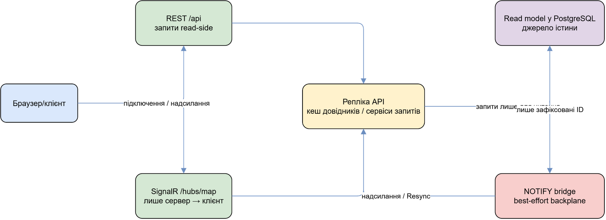
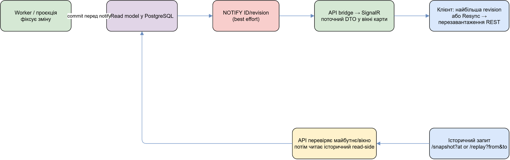
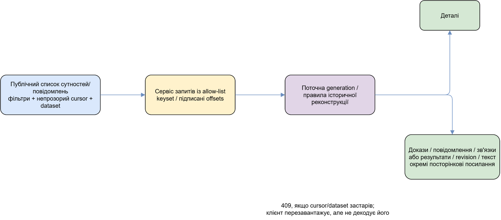

# Публічний API, realtime і read-side

## Призначення і межа доступу

`Puluj.Api` віддає read-side через REST `/api/*` та SignalR `/hubs/map`.
Публічні endpoints на цій сторінці лише читають cached/reference data або
PostgreSQL read models; worker/admin API виконує мутації окремо. У deployment
read-only DB role має бути обмежений саме цією межею. У Development доступний
OpenAPI endpoint; не слід публікувати вигадані request examples, IDs чи секрети.

Сторінка допомагає клієнту вибрати чинний endpoint і правильно обробити його
межі. Результат запиту — DTO лише для читання; він не дає права змінювати дані.
Для нового інтеграційного сценарію спершу звірте маршрут, обмеження параметрів
і поведінку помилки в таблиці нижче.

Редагована схема: [read-side-interaction.drawio](diagrams/read-side-interaction.drawio).

## REST route catalogue

| Family | Current GET routes | Parameters and limits |
| --- | --- | --- |
| Service/map | `/api/version`, `/api/health`, `/api/map/config`, `/api/snapshot`, `/api/replay`, `/api/timeline` | snapshot: `at`, `activeOnly`, map filters; replay: required `from`,`to`; timeline defaults to previous 6 h. Future history and too-large window are `400` with codes. |
| Tracks/targets/alerts | `/api/tracks/{id}`, `/api/tracks/{id}/predecessors`, `/api/targets/{id}`, `/api/targets`, `/api/alerts/history` | predecessors `depth` is clamped 1..4; targets accepts `since`,`until`,`limit`; alert history takes `placeId`,`hours`. Missing object is `404`. |
| Incidents | `/api/incidents`, `/api/incidents/{id}` | list supports `from`,`to`,`state`,`kind`,`category`,`cursor`,`limit`,`mode`,`asOf`; detail accepts `revision`. Public list excludes suppressed records. Invalid query is `400`; current map config bounds window/page. |
| Catalogue/messages | `/api/public/entities` and `/{kind}/{id}`, plus `/evidence`, `/messages`, `/relations`; `/api/public/messages` and `/{id}`, plus `/results`, `/revisions`, `/text` | list filters include source/taxonomy/location/confidence/time plus opaque `cursor`, `pageSize`, `dataset`; collection children use opaque `cursor`,`limit`,`dataset`. Page size is 1..100 (default 50), public window max 366 days. |
| Reference | `/api/taxonomy`, `/api/event-kinds`, `/api/sources`, `/api/places/search`, `/api/places/{id}`, `/api/places/regions`, `/api/places/{id}/geometry` | taxonomy/event kinds accept `includeDisabled`; place search needs `q` and optional `limit`. Not found is `404`. |
| Statistics | `/api/stats/targets`, `/api/stats/alerts`, `/api/stats/sources`, `/api/stats/recognition` | optional `from`,`to` and supported filters; `to <= from` is validation problem. Responses cache publicly for 60 s. |

Стандартна помилка для відсутнього ресурсу — `404`, для некоректного маршруту
чи параметрів — `400`/validation і RFC problem response. Якщо `dataset` або
`cursor` більше не відповідає active generation, API повертає `409`; клієнт
перезавантажує дані, а не намагається змінити чи декодувати cursor.

## Time, cursor, ID і provenance contracts

`/snapshot?at=` returns a historical state at the requested instant; it rejects
future time. `/replay` returns reports in a bounded interval for client
animation, not a stream of server mutations. Incidents support `mode=recorded`
with `asOf` for what the system had recorded, whereas public entity detail
requires `historyBasis=reconstructed&at=` for an historical reconstruction.

Cursors are opaque base64/keyset or signed offsets and bind filter/dataset/scope.
Clients must pass them through unchanged. REST map payloads and SignalR serialize
`long` map identities as decimal strings; catalogue DTOs also expose entity IDs
as strings where required. Treat every long ID as a decimal string end-to-end:
never coerce it to a JavaScript `number`. Geometry/precision and evidence refer
to reported/projection data, not a guarantee of exact location or factual proof.

## Realtime contract

Clients connect to `/hubs/map`; they invoke no hub methods. Server messages are
`TrackUpserted`, `TrackClosed`, `AlertChanged`, `TargetCreated`,
`IncidentUpserted`, `IncidentRevised`, and `Resync(at)`. The bridge reads only
current rows inside configured map/feed/incident windows. For incident changes a
durable `projection` subscription commits its receipt then emits PostgreSQL
notification containing ID/revision; each API replica turns it into a SignalR
push to its own clients. Track/alert notifications are emitted by their writers
after commit.

`LISTEN/NOTIFY` and SignalR are best-effort notification paths. On listener
reconnect the bridge sends `Resync`; a client reloads REST state and keeps the
highest known incident revision. Do not infer reliable delivery, total order or
an event history from hub messages.

Редагована схема: [live-update-history-replay.drawio](diagrams/live-update-history-replay.drawio).

## Public navigation and evidence

The catalogue is an allow-list adapter over existing read-side data; it does not
return raw payload, parser stage JSON or unbounded text. Public message list rows
represent saved source-message revisions. Detail links paginate results,
revisions and text chunks. Entity detail links paginate evidence, messages and
relations. Follow those links using the returned dataset/cursor so an active
generation change is detected rather than silently mixing snapshots.

Редагована схема: [public-catalogue-evidence.drawio](diagrams/public-catalogue-evidence.drawio).

## Перевірка і відомі межі

Route inventory походить з `EndpointRouteBuilderExtensions`, `StatsEndpoints`
та `Program`; contracts — з `Puluj.Contracts` і query services. Integration/unit
coverage for public catalogue/messages and incident/map read-side should be used
when змінюються routes, cursor або DTO. Cache headers (`map/config` 300 s,
statistics 60 s) не є гарантією freshness, а `Resync` не відновлює пропущені hub
packets сам по собі — він просить клієнта перечитати source of truth.
