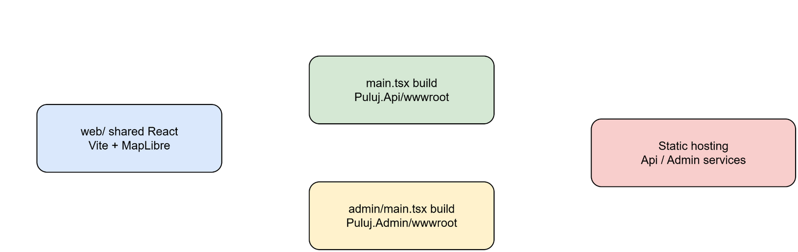

# Web-клієнти

Vite збирає публічний React/MapLibre клієнт і окрему admin SPA. Публічна карта читає `/api/map/config`, reference endpoints і `/api/snapshot`; історичний режим використовує track revisions через `/api/replay`.

SignalR доставляє best-effort повідомлення про committed зміни tracks, alerts і targets. На reconnect або `Resync` клієнт перечитує REST snapshot.

Admin SPA містить settings/sources, workers/containers, pipeline, catalog, LLM usage та analytics. `api/admin.ts` додає `X-Admin-Token` лише до admin requests; сервер усе одно перевіряє доступ.

MapLibre малює координати лише з DTO. Відсутнє або неточне місце не замінюється вигаданою точкою. Домашня локація й ETA живуть лише в браузері.

Редагована схема: [frontend-entrypoints-build-deploy.drawio](diagrams/frontend-entrypoints-build-deploy.drawio).
