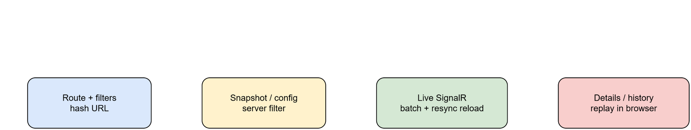
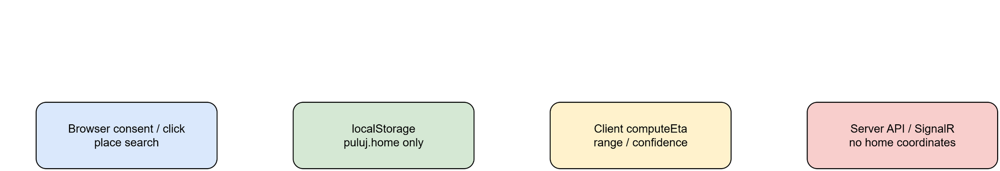
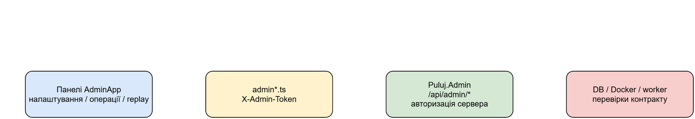

# Web-клієнти: публічна карта і адмін-панель

## Для чого ця сторінка

Тут описано, звідки збираються два клієнти, який API вони читають і що саме
лишається лише в браузері. Користуйтеся нею перед зміною маршруту, збірки або
відображення карти. Результат — сумісний build і клієнт, який не втрачає великі
ID, не декодує cursor та не надсилає координати домівки на сервер.

## Точки входу та доставка

`web/` — спільний React/TypeScript код з Vite і двома builds. `main.tsx` збирає публічну карту в `src/Puluj.Api/wwwroot`; `admin/main.tsx` збирає admin SPA з `admin.html` у `src/Puluj.Admin/wwwroot`. Vite dev servers: 5183 → Api (включно `/hubs`), 5184 → Admin (`/api`). Production static files віддають відповідні .NET-сервіси. `npm run build` виконує typecheck та обидва Vite builds; MapLibre не prebundle-иться, щоб зберегти worker.

Редагована схема: [frontend-entrypoints-build-deploy.drawio](diagrams/frontend-entrypoints-build-deploy.drawio).

## Публічна карта

Публічна навігація — hash routes: карта live/history, analytics, entities і messages; filters канонізуються у URL. На карті клієнт завантажує `/api/map/config`, regions, sources та `/api/snapshot`; server отримує canonical filter, а не browser-фільтрацію capped snapshot. History бере snapshot на `at`; replay завантажує `/api/replay` і анімує clock у браузері. Деталі/provenance використовують public entity/message endpoints, tracks, targets, predecessors та incident API. Великі ID в public catalogues лишаються string у TypeScript, opaque cursors не декодуються клієнтом.

Live SignalR `/hubs/map` подає track/alert/target та incident updates. Події batch-яться; за reconnect, `Resync` або period delta клієнт перезавантажує durable snapshot/window. При filters hub delta не домішується до стану — завантажується новий server-filtered snapshot. Помилки initial fetch показуються як error state; history і realtime не вважаються однаково повними.

Редагована схема: [public-map-user-flow.drawio](diagrams/public-map-user-flow.drawio).

MapLibre відображає точки лише за DTO/catalog location. Incident без координат не отримує вигадану anchor-точку: popup може відкритися у центрі карти, але такий incident не малюється як точка. Для tracks `fadeOpacity` працює локально за `lastSeenAt` і map-config `fadeMinutes`; це presentation, не зміна серверного стану.

## Privacy та ETA

«Моя точка» встановлюється кліком, пошуком place або явною browser geolocation згодою. Вона лежить лише в `localStorage` (`puluj.home`). `useEta`/`computeEta` виконуються у браузері з track, home і cached regions; клієнт не передає home coordinates у API чи SignalR. Пошук місця є запитом до `/api/places/search`, але не передачею персональної геолокації. ETA — діапазон/оцінка за місцем, курсом, speed profile й давністю, не прогноз або гарантований час прибуття.

Редагована схема: [privacy-boundary-user-location-eta.drawio](diagrams/privacy-boundary-user-location-eta.drawio).

## Admin UI та його API

`AdminApp` має panels settings/sources, workers/containers, pipeline, incidents, catalog, LLM usage та analytics. `api/admin.ts` додає `X-Admin-Token` з localStorage лише до admin requests; публічна карта цим клієнтом не користується. Admin API dependency — `/api/admin/*` на Admin service; access усе одно перевіряє сервер.

UI показує server errors (зокрема 409/422), вимагає actor/reason там, де цього вимагає контракт, і підтвердження для destructive actions. Container actions і analytics reset мають межі, описані в [admin-operations.md](admin-operations.md).

Редагована схема: [admin-ui-api-data-flow.drawio](diagrams/admin-ui-api-data-flow.drawio).

## Докази поведінки

Unit tests біля компонентів охоплюють routing/query/map-link, ETA, incident layer і live window. Playwright tests перевіряють public UI та основні admin flows. Fixtures і mocked responses у `web/e2e/fixtures/` підтверджують UI contract, але не замінюють service integration test.
